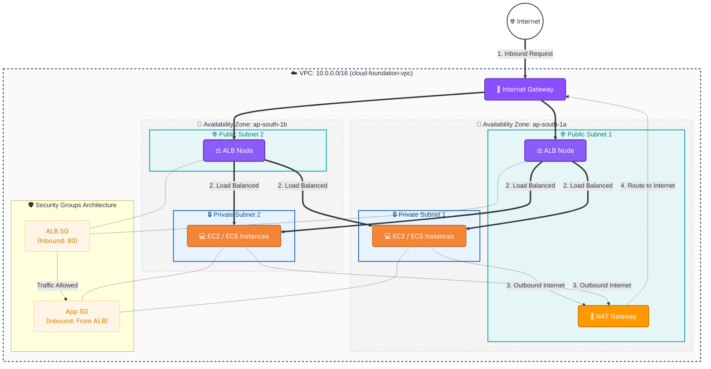

# AWS VPC Terraform Project

This repository contains a production-ready Terraform setup to provision a scalable, highly available Virtual Private Cloud (VPC) network in AWS. It follows infrastructure-as-code best practices, featuring modular design, consistent tagging, and CI/CD integration.

## 🌟 Architecture Overview

This project sets up the following resources in the `ap-south-1` region using a scalable **modular architecture**:

- **Modules**: Reusable building blocks for VPC, ALB, ECS, etc.
- **Environment (dev)**: Environment-specific configurations using modules.
- **VPC** with CIDR `10.0.0.0/16` (`cloud-foundation-vpc`).
- **2 Public Subnets** across two different Availability Zones (with auto-assigned public IP enabled).
- **2 Private Subnets** across two different Availability Zones.
- **Internet Gateway (IGW)** for public internet access.
- **NAT Gateway (with Elastic IP)** allowing private subnets to securely access the internet.
- **Application Load Balancer (ALB)** distributing traffic across targets.
- **Consistent Tagging** across all resources (Name, Environment, Project).

### 🖼️ Architecture Diagram



## 🏗️ Phase 2: Production-Ready Amazon EKS Platform

This project extends the Phase 1 Cloud Foundation with an enterprise-grade, HIPAA-compliant Amazon EKS platform:
- **Centralized KMS Encryption**: Dedicated Customer Managed Keys (CMKs) for Kubernetes Secrets, CloudWatch Logs, and ECR Repositories.
- **EKS Control Plane**: Configured with private endpoint access, audit logging, and the modern EKS Access Entry authentication system.
- **Managed Node Groups**: Configurable Spot/On-Demand pools using customized launch templates enforcing IMDSv2 and EBS volume encryption.
- **AWS & Helm Add-ons**: Sequence-ordered installations of CoreDNS, kube-proxy, VPC CNI, AWS Load Balancer Controller, Cluster Autoscaler, and Metrics Server.

For full implementation details, architectural diagrams, and design decisions, see the [walkthrough.md](file:///C:/Users/Tarun/.gemini/antigravity-ide/brain/20d9822d-d7ba-4a7d-8c75-e34dbda16037/walkthrough.md).
For operational upgrade playbooks, see [docs/UPGRADE.md](file:///d:/terraform-hippa/docs/UPGRADE.md).

### 🔑 EKS Access Entry Management

The EKS module manages access entries to the EKS cluster using the modern `aws_eks_access_entry` resource. To prevent `ResourceInUseException` during deployment (e.g., if the execution role already has an access entry or it was bootstrapped externally):

- **`create_caller_access_entry = true`** (Default): Use for the first deployment of a new cluster. Terraform will bootstrap and manage the caller Access Entry.
- **`create_caller_access_entry = false`**: Use when the Access Entry already exists (either created manually, bootstrapped externally, or imported into Terraform state). Terraform will skip creating it to prevent conflicts.

Configure this value in your environment's `main.tf` file under the `eks` module block based on the state of the cluster deployment.

## 🚀 Getting Started Locally

### Prerequisites
1. [Terraform CLI](https://developer.hashicorp.com/terraform/downloads) installed (v1.0.0+).
2. [AWS CLI](https://docs.aws.amazon.com/cli/latest/userguide/getting-started-install.html) installed.

### 🔐 1. IAM Setup for Terraform Execution

Terraform needs an AWS IAM user with programmatic access to manage resources.

1. Go to the AWS Management Console -> **IAM** -> **Users**.
2. Click **Create user**. Give it a name like `terraform-admin`.
3. Check **Provide user access to the AWS Management Console** (optional, but good for learning), or just proceed to the next step for programmatic access only.
4. On the **Set permissions** page, select **Attach policies directly**.
5. Search for and check **AdministratorAccess** (Note: this is great for learning/portfolio projects. For strict production, use least-privilege policies).
6. Complete user creation.
7. Click on the user `terraform-admin` -> **Security credentials** tab.
8. Scroll down to **Access keys** and click **Create access key**. Select **Command Line Interface (CLI)**.
9. Safely copy the **Access key ID** and **Secret access key**.

### 💻 2. Configure AWS CLI

Open your terminal and configure the AWS CLI with the credentials you just generated:

```bash
aws configure
```

It will prompt you for:
- **AWS Access Key ID**: Paste the Access key ID.
- **AWS Secret Access Key**: Paste the Secret access key.
- **Default region name**: `ap-south-1`
- **Default output format**: `json`

### 🛠️ 3. Code Quality Checks

Before initializing and deploying, ensure your code is formatted and valid. This is crucial for maintaining a clean, readable, and error-free codebase in production environments:

```bash
# Automatically formats Terraform code to standard canonical style
terraform fmt

# Validates syntax, arguments, and internal consistency of the configuration
terraform validate
```

### 🏗️ 4. Deploy Infrastructure

Navigate to the dev environment and run the following Terraform commands:

```bash
cd env/dev

# Initialize the Terraform working directory
terraform init

# Review the execution plan to see what resources will be created
terraform plan

# Apply the changes to create the infrastructure
terraform apply
```

To destroy the infrastructure when you're done testing:
```bash
cd env/dev
terraform destroy
```

## 💸 Cost Warning

* **Important:** This infrastructure includes a **NAT Gateway**, which incurs an hourly cost while running, as well as per-GB data processing fees.
* To avoid unexpected charges on your AWS account, always remember to run `terraform destroy` immediately after you are finished testing or demonstrating this project.

## ⚠️ Design Considerations

* **Cost Optimization vs. High Availability**: A single NAT Gateway is used in this setup to optimize costs, which means it is not highly available and introduces a single point of failure. (Check the `main.tf` file for commented-out code to enable a fully Highly Available multi-NAT setup).
* **Availability Zones**: Subnets are distributed evenly across multiple Availability Zones to provide redundancy.
* **Infrastructure as Code**: The entire infrastructure is managed strictly using Terraform to ensure reproducibility and immutability.

## ⚙️ CI/CD Pipeline & GitHub Integration

This repository implements a production-ready cloud pipeline with GitHub Actions using AWS OIDC authentication:

1. **[Validate](.github/workflows/terraform-validate.yml)**: Performs formatting, checks styles, and scans configurations using TFLint, tfsec, and Checkov on pull requests.
2. **[Plan](.github/workflows/terraform-plan.yml)**: Generates and archives binary plans, saves plans to text files, and calculates monthly cost estimations using Infracost.
3. **[Apply](.github/workflows/terraform-apply.yml)**: Downloads the compiled plan artifact and deploys it. Integrates with GitHub Environments (dev, stage, prod) to require manual approvals.
4. **[Drift Detection](.github/workflows/terraform-drift.yml)**: Scheduled cron verifying that the active AWS infrastructure matches the state configurations.
5. **[Destroy](.github/workflows/terraform-destroy.yml)**: Manual teardown workflow gated by confirmation controls and Environment approvals.

For detailed OIDC setup, environment promotion model, and recovery procedures, review the [cicd-pipeline.md](file:///d:/terraform-hippa/docs/cicd-pipeline.md) documentation.

### Secrets Configuration:
To wire OIDC authentication and cost estimation, define the following secrets in GitHub Settings:
- `AWS_ROLE_ARN`: IAM role ARN assumed via Web Identity (`CloudFoundationGitHubActionsRole`).
- `INFRACOST_API_KEY`: API key for cost breakdown reports (optional).

> [!IMPORTANT]
> Ensure any legacy static secrets (`AWS_ACCESS_KEY_ID`, `AWS_SECRET_ACCESS_KEY`) are deleted from GitHub Secrets to enforce the OIDC passwordless pipeline.

### OIDC Authentication & Backend Initialization Flow:
1. **OIDC Handshake**: GitHub Actions requests a JSON Web Token (JWT) from GitHub's OIDC provider.
2. **Role Assumption**: The JWT is presented to AWS STS via `AssumeRoleWithWebIdentity` to assume `CloudFoundationGitHubActionsRole`.
3. **Backend Initialization**: Terraform initializes using S3 remote backend `terraform-aws-enterprise-state` and acquires locks on DynamoDB table `terraform-state-lock` to check plan drift.
4. **Validation Verification**: Verification is performed in a read-only environment initialization step before applying resource changes.
