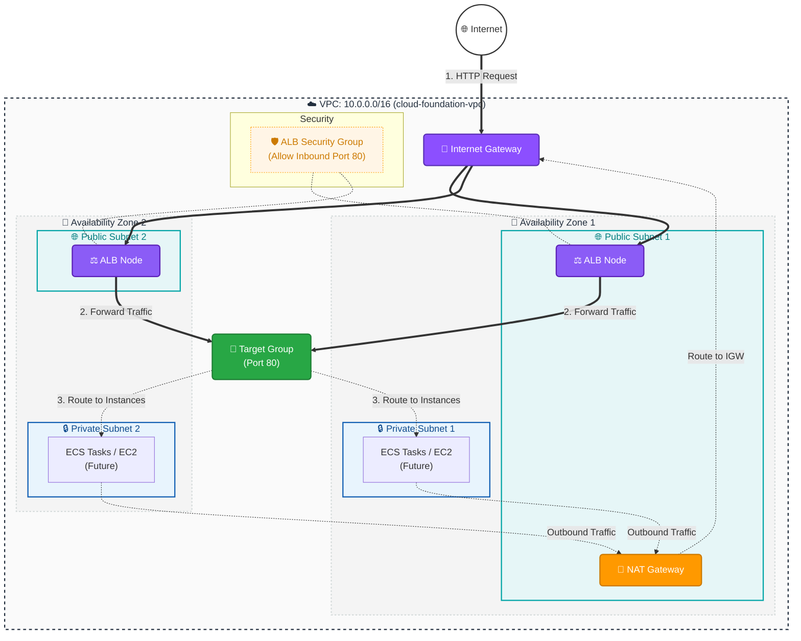

# Infrastructure Architecture Diagram

This document contains the visual architecture diagrams for the current infrastructure state (VPC and ALB) created by our Terraform modules.

## 1. VPC & ALB Mermaid Diagram

You can view this diagram natively on GitHub, or by using a Markdown preview extension in your IDE (like VS Code).

## Description of the Resources Generated by the Code:

1. **Networking Layer (VPC Module)**
   - **VPC**: 10.0.0.0/16 block providing the isolated network.
   - **Internet Gateway**: Attached to the VPC to allow public access.
   - **Public Subnets**: 2 Subnets distributed across 2 Availability Zones.
   - **Private Subnets**: 2 Subnets distributed across 2 Availability Zones for secure backend workloads.
   - **NAT Gateway**: Placed in Public Subnet 1 to grant Private Subnets secure outbound-only internet access.

2. **Load Balancing Layer (ALB Module)**
   - **ALB Security Group**: Allows incoming internet traffic on Port 80.
   - **Application Load Balancer**: Spans across the 2 Public Subnets.
   - **Listener**: Listens on HTTP Port 80 and forwards traffic to the Target Group.
   - **Target Group**: Currently configured to register IPs (which will be your future ECS tasks).
