# Phase 1 Infrastructure Architecture Review

This document provides a detailed overview of the Phase 1 AWS infrastructure foundation, which forms a secure, highly available networking platform compliant with HIPAA requirements for healthcare SaaS workloads.

## Architecture Diagram

```mermaid
graph TB
    classDef default font-family:Inter, sans-serif;
    classDef vpc fill:#FAFAFA,stroke:#232F3E,stroke-width:2px,color:#232F3E;
    classDef az fill:#F4F4F4,stroke:#D5DBDB,stroke-width:1px,stroke-dasharray: 5 5,color:#232F3E;
    classDef public fill:#E6F6F7,stroke:#00A4A6,stroke-width:1px,color:#007D7E;
    classDef private fill:#E8F4FD,stroke:#125FB3,stroke-width:1px,color:#0E4A8C;
    classDef db fill:#F6EEF9,stroke:#9D3FBD,stroke-width:1px,color:#6C1F8C;
    classDef igw fill:#8C4FFF,stroke:#5A30B5,stroke-width:2px,color:#FFF,rx:5,ry:5;
    classDef nat fill:#FF9900,stroke:#CC7A00,stroke-width:2px,color:#FFF,rx:5,ry:5;
    classDef endpoint fill:#10b981,stroke:#047857,stroke-width:2px,color:#FFF,rx:5,ry:5;

    Internet((🌐 Internet))

    subgraph VPC ["☁️ AWS VPC: 10.0.0.0/16"]
        direction TB
        IGW["🚪 Internet Gateway"]:::igw
        FlowLogs["📊 VPC Flow Logs -> CloudWatch Logs"]

        subgraph AZ1 ["Availability Zone A"]
            Pub1["🌐 Public Subnet A (10.0.1.0/24)"]:::public
            App1["🔒 Private App Subnet A (10.0.10.0/24)"]:::private
            DB1["🗄️ Private DB Subnet A (10.0.20.0/24)"]:::db
            NAT1["🔄 NAT Gateway A"]:::nat
        end

        subgraph AZ2 ["Availability Zone B"]
            Pub2["🌐 Public Subnet B (10.0.2.0/24)"]:::public
            App2["🔒 Private App Subnet B (10.0.11.0/24)"]:::private
            DB2["🗄️ Private DB Subnet B (10.0.21.0/24)"]:::db
            NAT2["🔄 NAT Gateway B (Prod Only)"]:::nat
        end

        subgraph AZ3 ["Availability Zone C"]
            Pub3["🌐 Public Subnet C (10.0.3.0/24)"]:::public
            App3["🔒 Private App Subnet C (10.0.12.0/24)"]:::private
            DB3["🗄️ Private DB Subnet C (10.0.22.0/24)"]:::db
            NAT3["🔄 NAT Gateway C (Prod Only)"]:::nat
        end

        subgraph VPCEndpoints ["🔒 AWS PrivateLink VPC Endpoints"]
            S3_EP["S3 Gateway Endpoint"]:::endpoint
            ECR_API["ECR API Endpoint"]:::endpoint
            ECR_DKR["ECR DKR Endpoint"]:::endpoint
            CW_LOGS["CloudWatch Logs Endpoint"]:::endpoint
            CW_MON["CloudWatch Monitoring Endpoint"]:::endpoint
            STS["STS Endpoint"]:::endpoint
            SM["Secrets Manager Endpoint"]:::endpoint
            SSM["SSM Endpoint"]:::endpoint
            SSM_MSG["SSM Messages Endpoint"]:::endpoint
            EC2_MSG["EC2 Messages Endpoint"]:::endpoint
        end
    end

    %% Edge Mappings
    Internet === IGW
    IGW === Pub1 & Pub2 & Pub3
    Pub1 === NAT1
    
    %% Compute egress
    App1 -.-> NAT1
    App2 -.-> NAT1 & NAT2
    App3 -.-> NAT1 & NAT3

    %% PrivateLink Associations
    App1 & App2 & App3 === VPCEndpoints
    DB1 & DB2 & DB3 -. "S3 Only" .-> S3_EP
```

## Architectural Decisions & Rationales

### 1. Multi-Tier Subnet Design
- **Subnet Separation**: Public, Private Application, and Private Database subnets are separated to restrict network access as required by HIPAA guidelines. 
- **Database Tier Isolation**: Database subnets have absolutely no route to the internet, NAT Gateways, or Internet Gateways. Access to database endpoints is physically constrained inside the VPC and limited through Network ACLs and security groups, isolating patient health records (PHI).

### 2. High Availability NAT Strategy
- **Dev Configuration**: A single NAT Gateway is shared across all availability zones. This results in significant cost savings (~$64/month in NAT charges) during the development and testing phases.
- **Production Configuration**: `single_nat_gateway` is set to `false`, creating one NAT Gateway per availability zone (3 total). This avoids cross-AZ traffic charges and ensures that an outage in a single AWS availability zone does not impact the outbound internet connection for compute components running in remaining zones.

### 3. VPC Endpoints (PrivateLink) Integration
- **Rationale**: Trailing API requests for AWS resources (like pulling container images from ECR or pushing metrics/logs to CloudWatch) through public NAT Gateways is less secure and incurs data processing costs. Private interface and gateway endpoints keep all AWS API traffic on the Amazon private backbone.
- **KMS Readiness**: The endpoint strategy is set up with a reusable loop. Adding the AWS KMS endpoint in Phase 2 requires only a one-line amendment to a map variable and will not impact existing route tables, subnets, or security group rules.

### 4. VPC Flow Logs for Auditing
- **Auditing Requirement**: HIPAA security rule CFR 164.312(b) requires logs and tracking of all access and movements of electronic Protected Health Information (ePHI). VPC Flow Logs capture metadata of all connections traversing the network interfaces within the VPC. Flow Logs are pushed directly to a CloudWatch Log group with a configurable retention policy.
