# AWS Enterprise EKS Platform: Infrastructure Audit & Deployment Report

This report provides a comprehensive audit of the Terraform-managed infrastructure for the **AWS Enterprise EKS Platform** across the three environments: **dev**, **stage**, and **prod**. 

---

## Workspace Configuration & Environments Overview

The project is structured into three environment directories under `env/` and a set of reusable modules under `modules/`.

- **ap-south-1** (Mumbai) is the target AWS Region for all deployments.
- **CIDR Layout** (identical across all environments):
  - **VPC CIDR**: `10.0.0.0/16`
  - **Public Subnets**: `10.0.1.0/24`, `10.0.2.0/24`, `10.0.3.0/24` (Multi-AZ)
  - **Private App Subnets**: `10.0.10.0/24`, `10.0.11.0/24`, `10.0.12.0/24` (Multi-AZ)
  - **Database Subnets**: `10.0.20.0/24`, `10.0.21.0/24`, `10.0.22.0/24` (Multi-AZ)

### Environment Sizing and Scaling Configurations

| Parameter / Resource | Dev (`env/dev`) | Stage (`env/stage`) | Prod (`env/prod`) |
| :--- | :--- | :--- | :--- |
| **NAT Gateway Strategy** | Single NAT Gateway (Shared) | Single NAT Gateway (Shared) | Multi-AZ (1 NAT Gateway per AZ) |
| **Flow Logs Retention** | 30 Days | 90 Days | 365 Days |
| **EKS Log Group Retention**| 30 Days | 90 Days | 365 Days |
| **System Node Group Type** | `t3.medium` (On-Demand) | `t3.large` (On-Demand) | `m6i.large` (On-Demand) |
| **System Node Scaling** | Min: 1, Desired: 2, Max: 3 | Min: 2, Desired: 2, Max: 4 | Min: 2, Desired: 2, Max: 4 |
| **Application Node Type** | `t3.medium` (Spot) | `t3.large` (Spot) | `m6i.large` (On-Demand) |
| **Application Node Scaling**| Min: 1, Desired: 2, Max: 5 | Min: 2, Desired: 3, Max: 6 | Min: 3, Desired: 3, Max: 10 |

---

# AUDITED RESOURCES DETAILS

Below is the detailed resource-by-resource audit. For resources declared using counts or collections (such as subnets, ECR repos, interface endpoints), the configurations are grouped logically to avoid redundant information while detailing the exact naming convention, environment variations, and dependencies for all instances.

---

## 1. Networking (Phase 1)

### 1.1 VPC
*   **Resource Type**: VPC
*   **Terraform Resource**: `aws_vpc.main`
*   **Module Name**: `vpc`
*   **Resource Name**:
    *   **dev**: `cloud-foundation-dev-vpc`
    *   **stage**: `cloud-foundation-stage-vpc`
    *   **prod**: `cloud-foundation-prod-vpc`
*   **Tags**:
    *   `Project` = `cloud-foundation`
    *   `Environment` = `dev` / `stage` / `prod`
    *   `Application` = `Infrastructure`
    *   `Owner` = `Platform-Team`
    *   `ManagedBy` = `Terraform`
    *   `CostCenter` = `Engineering`
    *   `Compliance` = `HIPAA`
    *   `DataClassification` = `Confidential`
    *   `Backup` = `Enabled`
    *   `Name` = `cloud-foundation-{env}-vpc`
*   **AWS Region**: `ap-south-1`
*   **Dependencies**: None
*   **Which module creates it**: `module.vpc`
*   **Which environment creates it**: `dev`, `stage`, `prod`
*   **Shared or environment-specific**: Environment-specific
*   **Incurs AWS charges**: No (AWS does not charge for VPC itself)
*   **Estimated purpose**: Provides logical isolation and the networking boundary for the entire environment.
*   **Mandatory for EKS**: Yes
*   **Optional**: No
*   **Deleted during destroy**: Yes
*   **Lifecycle configuration**: None
*   **depends_on configuration**: None
*   **Outputs related**: `vpc_id`, `vpc_cidr_block`
*   **Variables used**: `vpc_cidr`, `project_name`, `environment`, tagging variables
*   **Encryption enabled**: N/A
*   **IMDSv2 enabled**: N/A
*   **gp3 encrypted volumes**: N/A
*   **IRSA used**: No
*   **OIDC used**: No
*   **Managed by**: Terraform

### 1.2 Default Security Group
*   **Resource Type**: Security Group
*   **Terraform Resource**: `aws_default_security_group.default`
*   **Module Name**: `vpc`
*   **Resource Name**: `default` (associated with VPC)
*   **Tags**: None (left empty for isolation)
*   **AWS Region**: `ap-south-1`
*   **Dependencies**: `aws_vpc.main`
*   **Which module creates it**: `module.vpc`
*   **Which environment creates it**: `dev`, `stage`, `prod`
*   **Shared or environment-specific**: Environment-specific
*   **Incurs AWS charges**: No
*   **Estimated purpose**: Re-configures the default VPC security group to act as a placeholder that blocks all inbound and outbound traffic by default, preventing its accidental use.
*   **Mandatory for EKS**: No (but a security best practice)
*   **Optional**: Yes (but hardened by default here)
*   **Deleted during destroy**: No (default SG is managed/cleared by Terraform but deleted by AWS when VPC is deleted)
*   **Lifecycle configuration**: None
*   **depends_on configuration**: None
*   **Outputs related**: None
*   **Variables used**: None
*   **Encryption enabled**: N/A
*   **IMDSv2 enabled**: N/A
*   **gp3 encrypted volumes**: N/A
*   **IRSA used**: No
*   **OIDC used**: No
*   **Managed by**: Terraform / AWS

### 1.3 Internet Gateway
*   **Resource Type**: Internet Gateway
*   **Terraform Resource**: `aws_internet_gateway.igw`
*   **Module Name**: `vpc`
*   **Resource Name**:
    *   **dev**: `cloud-foundation-dev-igw`
    *   **stage**: `cloud-foundation-stage-igw`
    *   **prod**: `cloud-foundation-prod-igw`
*   **Tags**: Standard environment tags + `Name` = `cloud-foundation-{env}-igw`
*   **AWS Region**: `ap-south-1`
*   **Dependencies**: `aws_vpc.main`
*   **Which module creates it**: `module.vpc`
*   **Which environment creates it**: `dev`, `stage`, `prod`
*   **Shared or environment-specific**: Environment-specific
*   **Incurs AWS charges**: No
*   **Estimated purpose**: Provides outbound and inbound routing for public-facing subnets.
*   **Mandatory for EKS**: Yes (required for internet-facing ALBs and NAT GW outbound paths)
*   **Optional**: No (under this design)
*   **Deleted during destroy**: Yes
*   **Lifecycle configuration**: None
*   **depends_on configuration**: None
*   **Outputs related**: `internet_gateway_id`
*   **Variables used**: Standard variables, tagging variables
*   **Encryption enabled**: N/A
*   **IMDSv2 enabled**: N/A
*   **gp3 encrypted volumes**: N/A
*   **IRSA used**: No
*   **OIDC used**: No
*   **Managed by**: Terraform

### 1.4 Public Subnets (3 AZs)
*   **Resource Type**: Subnet
*   **Terraform Resource**: `aws_subnet.public` (count = 3)
*   **Module Name**: `vpc`
*   **Resource Name**:
    *   `cloud-foundation-{env}-subnet-public-ap-south-1a` (CIDR: `10.0.1.0/24`)
    *   `cloud-foundation-{env}-subnet-public-ap-south-1b` (CIDR: `10.0.2.0/24`)
    *   `cloud-foundation-{env}-subnet-public-ap-south-1c` (CIDR: `10.0.3.0/24`)
*   **Tags**:
    *   Standard environment tags
    *   `Name` = `cloud-foundation-{env}-subnet-public-{AZ}`
    *   `kubernetes.io/role/elb` = `1` (Allows AWS Load Balancer Controller to auto-discover subnets for external ALBs)
    *   `kubernetes.io/cluster/cloud-foundation-{env}-eks` = `shared`
*   **AWS Region**: `ap-south-1`
*   **Dependencies**: `aws_vpc.main`, dynamic query of `data.aws_availability_zones.available`
*   **Which module creates it**: `module.vpc`
*   **Which environment creates it**: `dev`, `stage`, `prod`
*   **Shared or environment-specific**: Environment-specific
*   **Incurs AWS charges**: No
*   **Estimated purpose**: Houses public-facing resources (ALBs, NAT Gateways).
*   **Mandatory for EKS**: Yes (required for load balancers)
*   **Optional**: No
*   **Deleted during destroy**: Yes
*   **Lifecycle configuration**: None
*   **depends_on configuration**: None
*   **Outputs related**: `public_subnet_ids`
*   **Variables used**: `public_subnet_cidrs`, `eks_cluster_name`, tagging variables
*   **Encryption enabled**: N/A
*   **IMDSv2 enabled**: N/A
*   **gp3 encrypted volumes**: N/A
*   **IRSA used**: No
*   **OIDC used**: No
*   **Managed by**: Terraform

### 1.5 Private Application Subnets (3 AZs)
*   **Resource Type**: Subnet
*   **Terraform Resource**: `aws_subnet.private` (count = 3)
*   **Module Name**: `vpc`
*   **Resource Name**:
    *   `cloud-foundation-{env}-subnet-private-app-ap-south-1a` (CIDR: `10.0.10.0/24`)
    *   `cloud-foundation-{env}-subnet-private-app-ap-south-1b` (CIDR: `10.0.11.0/24`)
    *   `cloud-foundation-{env}-subnet-private-app-ap-south-1c` (CIDR: `10.0.12.0/24`)
*   **Tags**:
    *   Standard environment tags
    *   `Name` = `cloud-foundation-{env}-subnet-private-app-{AZ}`
    *   `kubernetes.io/role/internal-elb` = `1` (Allows AWS Load Balancer Controller to discover subnets for internal ALBs)
    *   `kubernetes.io/cluster/cloud-foundation-{env}-eks` = `shared`
*   **AWS Region**: `ap-south-1`
*   **Dependencies**: `aws_vpc.main`, dynamic query of `data.aws_availability_zones.available`
*   **Which module creates it**: `module.vpc`
*   **Which environment creates it**: `dev`, `stage`, `prod`
*   **Shared or environment-specific**: Environment-specific
*   **Incurs AWS charges**: No
*   **Estimated purpose**: Houses EKS managed nodes and applications to restrict them from having public IPs.
*   **Mandatory for EKS**: Yes
*   **Optional**: No
*   **Deleted during destroy**: Yes
*   **Lifecycle configuration**: None
*   **depends_on configuration**: None
*   **Outputs related**: `private_subnet_ids`
*   **Variables used**: `private_subnet_cidrs`, `eks_cluster_name`, tagging variables
*   **Encryption enabled**: N/A
*   **IMDSv2 enabled**: N/A
*   **gp3 encrypted volumes**: N/A
*   **IRSA used**: No
*   **OIDC used**: No
*   **Managed by**: Terraform

### 1.6 Private Database Subnets (3 AZs)
*   **Resource Type**: Subnet
*   **Terraform Resource**: `aws_subnet.database` (count = 3)
*   **Module Name**: `vpc`
*   **Resource Name**:
    *   `cloud-foundation-{env}-subnet-database-ap-south-1a` (CIDR: `10.0.20.0/24`)
    *   `cloud-foundation-{env}-subnet-database-ap-south-1b` (CIDR: `10.0.21.0/24`)
    *   `cloud-foundation-{env}-subnet-database-ap-south-1c` (CIDR: `10.0.22.0/24`)
*   **Tags**: Standard environment tags + `Name` = `cloud-foundation-{env}-subnet-database-{AZ}`
*   **AWS Region**: `ap-south-1`
*   **Dependencies**: `aws_vpc.main`, dynamic query of `data.aws_availability_zones.available`
*   **Which module creates it**: `module.vpc`
*   **Which environment creates it**: `dev`, `stage`, `prod`
*   **Shared or environment-specific**: Environment-specific
*   **Incurs AWS charges**: No
*   **Estimated purpose**: Houses isolated databases (RDS PostgreSQL) away from the compute node subnets.
*   **Mandatory for EKS**: No (but required for database isolation)
*   **Optional**: Yes
*   **Deleted during destroy**: Yes
*   **Lifecycle configuration**: None
*   **depends_on configuration**: None
*   **Outputs related**: `database_subnet_ids`
*   **Variables used**: `database_subnet_cidrs`, tagging variables
*   **Encryption enabled**: N/A
*   **IMDSv2 enabled**: N/A
*   **gp3 encrypted volumes**: N/A
*   **IRSA used**: No
*   **OIDC used**: No
*   **Managed by**: Terraform

### 1.7 DB Subnet Group
*   **Resource Type**: DB Subnet Group
*   **Terraform Resource**: `aws_db_subnet_group.database`
*   **Module Name**: `vpc`
*   **Resource Name**: `cloud-foundation-{env}-db-subnet-group`
*   **Tags**: Standard environment tags + `Name` = `cloud-foundation-{env}-db-subnet-group`
*   **AWS Region**: `ap-south-1`
*   **Dependencies**: `aws_subnet.database[*]`
*   **Which module creates it**: `module.vpc`
*   **Which environment creates it**: `dev`, `stage`, `prod`
*   **Shared or environment-specific**: Environment-specific
*   **Incurs AWS charges**: No
*   **Estimated purpose**: Groups the isolated database subnets for RDS DB instance deployments across multiple AZs.
*   **Mandatory for EKS**: No
*   **Optional**: Yes (but required for DB setup)
*   **Deleted during destroy**: Yes
*   **Lifecycle configuration**: None
*   **depends_on configuration**: None
*   **Outputs related**: `database_subnet_group_name`
*   **Variables used**: Standard variables, tagging variables
*   **Encryption enabled**: N/A
*   **IMDSv2 enabled**: N/A
*   **gp3 encrypted volumes**: N/A
*   **IRSA used**: No
*   **OIDC used**: No
*   **Managed by**: Terraform

### 1.8 NAT Elastic IPs (EIPs)
*   **Resource Type**: Elastic IP
*   **Terraform Resource**: `aws_eip.nat`
*   **Module Name**: `vpc`
*   **Resource Name**:
    *   **dev**: `cloud-foundation-dev-nat-eip-ap-south-1a` (1 EIP)
    *   **stage**: `cloud-foundation-stage-nat-eip-ap-south-1a` (1 EIP)
    *   **prod**: `cloud-foundation-prod-nat-eip-ap-south-1a`, `-ap-south-1b`, `-ap-south-1c` (3 EIPs)
*   **Tags**: Standard environment tags + `Name` = `cloud-foundation-{env}-nat-eip-{AZ}`
*   **AWS Region**: `ap-south-1`
*   **Dependencies**: `aws_internet_gateway.igw`
*   **Which module creates it**: `module.vpc`
*   **Which environment creates it**: `dev`, `stage`, `prod`
*   **Shared or environment-specific**: Environment-specific
*   **Incurs AWS charges**: No (Elastic IPs are free when attached to a running NAT gateway; however, they incur charges if unattached, which does not apply here during runtime)
*   **Estimated purpose**: Provides static public IPs for NAT Gateways.
*   **Mandatory for EKS**: Yes (EKS nodes in private subnets require NAT GW to pull images and access APIs)
*   **Optional**: No
*   **Deleted during destroy**: Yes
*   **Lifecycle configuration**: None
*   **depends_on configuration**: `depends_on = [aws_internet_gateway.igw]` (Ensures IGW is ready before allocating EIPs)
*   **Outputs related**: `nat_gateway_ips`
*   **Variables used**: `enable_nat_gateway`, `single_nat_gateway`, tagging variables
*   **Encryption enabled**: N/A
*   **IMDSv2 enabled**: N/A
*   **gp3 encrypted volumes**: N/A
*   **IRSA used**: No
*   **OIDC used**: No
*   **Managed by**: Terraform

### 1.9 NAT Gateways
*   **Resource Type**: NAT Gateway
*   **Terraform Resource**: `aws_nat_gateway.nat`
*   **Module Name**: `vpc`
*   **Resource Name**:
    *   **dev**: `cloud-foundation-dev-nat-gw-ap-south-1a` (1 GW)
    *   **stage**: `cloud-foundation-stage-nat-gw-ap-south-1a` (1 GW)
    *   **prod**: `cloud-foundation-prod-nat-gw-ap-south-1a`, `-ap-south-1b`, `-ap-south-1c` (3 GWs)
*   **Tags**: Standard environment tags + `Name` = `cloud-foundation-{env}-nat-gw-{AZ}`
*   **AWS Region**: `ap-south-1`
*   **Dependencies**: `aws_eip.nat`, `aws_subnet.public`, `aws_internet_gateway.igw`
*   **Which module creates it**: `module.vpc`
*   **Which environment creates it**: `dev`, `stage`, `prod`
*   **Shared or environment-specific**: Environment-specific
*   **Incurs AWS charges**: **Yes (Hourly cost: ~$0.045 per NAT Gateway + Data processing charges ~$0.045 per GB)**
*   **Estimated purpose**: Translates outbound traffic from private application subnets to the public internet.
*   **Mandatory for EKS**: Yes
*   **Optional**: No
*   **Deleted during destroy**: Yes
*   **Lifecycle configuration**: None
*   **depends_on configuration**: `depends_on = [aws_internet_gateway.igw]`
*   **Outputs related**: `nat_gateway_ids`
*   **Variables used**: `enable_nat_gateway`, `single_nat_gateway`, tagging variables
*   **Encryption enabled**: N/A
*   **IMDSv2 enabled**: N/A
*   **gp3 encrypted volumes**: N/A
*   **IRSA used**: No
*   **OIDC used**: No
*   **Managed by**: Terraform

### 1.10 Route Tables
*   **Resource Type**: Route Table
*   **Terraform Resource**:
    *   `aws_route_table.public` (1 resource)
    *   `aws_route_table.private` (dev/stage: 1 resource, prod: 3 resources)
    *   `aws_route_table.database` (1 resource)
*   **Module Name**: `vpc`
*   **Resource Name**:
    *   `cloud-foundation-{env}-rt-public` (Public RT)
    *   `cloud-foundation-{env}-rt-private-shared` (Dev/Stage Private RT)
    *   `cloud-foundation-{env}-rt-private-{AZ}` (Prod Private RTs)
    *   `cloud-foundation-{env}-rt-database` (Database RT)
*   **Tags**: Standard environment tags + `Name` matching the resource name above.
*   **AWS Region**: `ap-south-1`
*   **Dependencies**: `aws_vpc.main`, `aws_internet_gateway.igw` (public route), `aws_nat_gateway.nat` (private route)
*   **Which module creates it**: `module.vpc`
*   **Which environment creates it**: `dev`, `stage`, `prod`
*   **Shared or environment-specific**: Environment-specific
*   **Incurs AWS charges**: No
*   **Estimated purpose**: Directs VPC subnet traffic to target gateways (IGW/NAT GW/local VPC).
*   **Mandatory for EKS**: Yes
*   **Optional**: No
*   **Deleted during destroy**: Yes
*   **Lifecycle configuration**: None
*   **depends_on configuration**: None
*   **Outputs related**: `public_route_table_id`, `private_route_table_ids`, `database_route_table_id`
*   **Variables used**: `single_nat_gateway`, tagging variables
*   **Encryption enabled**: N/A
*   **IMDSv2 enabled**: N/A
*   **gp3 encrypted volumes**: N/A
*   **IRSA used**: No
*   **OIDC used**: No
*   **Managed by**: Terraform

### 1.11 Route Table Associations
*   **Resource Type**: Route Table Association
*   **Terraform Resource**:
    *   `aws_route_table_association.public` (3 resources)
    *   `aws_route_table_association.private` (3 resources)
    *   `aws_route_table_association.database` (3 resources)
*   **Module Name**: `vpc`
*   **Resource Name**: None (Route Table Associations do not have distinct names in AWS console)
*   **Tags**: None
*   **AWS Region**: `ap-south-1`
*   **Dependencies**: Subnets (`aws_subnet.*`), Route Tables (`aws_route_table.*`)
*   **Which module creates it**: `module.vpc`
*   **Which environment creates it**: `dev`, `stage`, `prod`
*   **Shared or environment-specific**: Environment-specific
*   **Incurs AWS charges**: No
*   **Estimated purpose**: Binds subnets to their respective route tables.
*   **Mandatory for EKS**: Yes
*   **Optional**: No
*   **Deleted during destroy**: Yes
*   **Lifecycle configuration**: None
*   **depends_on configuration**: None
*   **Outputs related**: None
*   **Variables used**: None
*   **Encryption enabled**: N/A
*   **IMDSv2 enabled**: N/A
*   **gp3 encrypted volumes**: N/A
*   **IRSA used**: No
*   **OIDC used**: No
*   **Managed by**: Terraform

### 1.12 VPC Flow Log
*   **Resource Type**: VPC Flow Log
*   **Terraform Resource**: `aws_flow_log.main`
*   **Module Name**: `vpc`
*   **Resource Name**: `cloud-foundation-{env}-vpc-flow-logs`
*   **Tags**: Standard environment tags + `Name` = `cloud-foundation-{env}-vpc-flow-logs`
*   **AWS Region**: `ap-south-1`
*   **Dependencies**: `aws_vpc.main`, `aws_iam_role.vpc_flow_log_role`, `aws_cloudwatch_log_group.vpc_flow_logs`
*   **Which module creates it**: `module.vpc`
*   **Which environment creates it**: `dev`, `stage`, `prod`
*   **Shared or environment-specific**: Environment-specific
*   **Incurs AWS charges**: **Yes (Incurs Flow Logs vending and CloudWatch Log ingestion charges)**
*   **Estimated purpose**: Captures all IP traffic traversing the VPC for HIPAA auditing.
*   **Mandatory for EKS**: No (but mandatory for HIPAA compliance)
*   **Optional**: Yes (but configured as active here)
*   **Deleted during destroy**: Yes
*   **Lifecycle configuration**: None
*   **depends_on configuration**: None
*   **Outputs related**: None
*   **Variables used**: `enable_flow_logs`, tagging variables
*   **Encryption enabled**: N/A (Flow logs data is sent to CloudWatch Logs Group which is encrypted)
*   **IMDSv2 enabled**: N/A
*   **gp3 encrypted volumes**: N/A
*   **IRSA used**: No
*   **OIDC used**: No
*   **Managed by**: Terraform

### 1.13 Flow Logs CloudWatch Log Group
*   **Resource Type**: CloudWatch Log Group
*   **Terraform Resource**: `aws_cloudwatch_log_group.vpc_flow_logs`
*   **Module Name**: `vpc`
*   **Resource Name**: `/aws/vpc-flow-logs/cloud-foundation-{env}`
*   **Tags**: Standard environment tags + `Name` = `cloud-foundation-{env}-flow-logs-group`
*   **AWS Region**: `ap-south-1`
*   **Dependencies**: None
*   **Which module creates it**: `module.vpc`
*   **Which environment creates it**: `dev`, `stage`, `prod`
*   **Shared or environment-specific**: Environment-specific
*   **Incurs AWS charges**: **Yes (Incurs ingestion charges ~$0.50 per GB + Storage charges ~$0.03 per GB/month)**
*   **Estimated purpose**: Stores flow log records.
*   **Mandatory for EKS**: No (mandatory for HIPAA audit logs)
*   **Optional**: Yes
*   **Deleted during destroy**: Yes
*   **Lifecycle configuration**: None
*   **depends_on configuration**: None
*   **Outputs related**: None
*   **Variables used**: `enable_flow_logs`, `flow_logs_retention_days`, tagging variables
*   **Encryption enabled**: **No (Uses CloudWatch service default encryption. KMS key is not passed in main.tf for flow logs)**
*   **IMDSv2 enabled**: N/A
*   **gp3 encrypted volumes**: N/A
*   **IRSA used**: No
*   **OIDC used**: No
*   **Managed by**: Terraform

### 1.14 VPC Flow Logs IAM Role
*   **Resource Type**: IAM Role
*   **Terraform Resource**: `aws_iam_role.vpc_flow_log_role`
*   **Module Name**: `vpc`
*   **Resource Name**: `cloud-foundation-{env}-vpc-flow-logs-role`
*   **Tags**: Standard environment tags
*   **AWS Region**: `ap-south-1` (Global Resource)
*   **Dependencies**: None
*   **Which module creates it**: `module.vpc`
*   **Which environment creates it**: `dev`, `stage`, `prod`
*   **Shared or environment-specific**: Environment-specific
*   **Incurs AWS charges**: No
*   **Estimated purpose**: Grants VPC Flow Logs service permission to write log streams to CloudWatch.
*   **Mandatory for EKS**: No (required for VPC Flow logs)
*   **Optional**: Yes
*   **Deleted during destroy**: Yes
*   **Lifecycle configuration**: None
*   **depends_on configuration**: None
*   **Outputs related**: None
*   **Variables used**: `enable_flow_logs`, tagging variables
*   **Encryption enabled**: N/A
*   **IMDSv2 enabled**: N/A
*   **gp3 encrypted volumes**: N/A
*   **IRSA used**: No
*   **OIDC used**: No
*   **Managed by**: Terraform

### 1.15 VPC Flow Logs IAM Role Policy
*   **Resource Type**: IAM Role Policy (Inline)
*   **Terraform Resource**: `aws_iam_role_policy.vpc_flow_log_policy`
*   **Module Name**: `vpc`
*   **Resource Name**: `cloud-foundation-{env}-vpc-flow-logs-policy`
*   **Tags**: None (does not support tags)
*   **AWS Region**: `ap-south-1` (Global Resource)
*   **Dependencies**: `aws_iam_role.vpc_flow_log_role`, `aws_cloudwatch_log_group.vpc_flow_logs`
*   **Which module creates it**: `module.vpc`
*   **Which environment creates it**: `dev`, `stage`, `prod`
*   **Shared or environment-specific**: Environment-specific
*   **Incurs AWS charges**: No
*   **Estimated purpose**: Defines the specific CloudWatch Logs API actions the Flow Logs service can execute.
*   **Mandatory for EKS**: No
*   **Optional**: Yes
*   **Deleted during destroy**: Yes
*   **Lifecycle configuration**: None
*   **depends_on configuration**: None
*   **Outputs related**: None
*   **Variables used**: `enable_flow_logs`
*   **Encryption enabled**: N/A
*   **IMDSv2 enabled**: N/A
*   **gp3 encrypted volumes**: N/A
*   **IRSA used**: No
*   **OIDC used**: No
*   **Managed by**: Terraform

### 1.16 Network ACLs (NACLs)
*   **Resource Type**: Network ACL
*   **Terraform Resource**:
    *   `aws_network_acl.public` (1 resource, associated with public subnets)
    *   `aws_network_acl.private` (1 resource, associated with private subnets)
    *   `aws_network_acl.database` (1 resource, associated with database subnets)
*   **Module Name**: `vpc`
*   **Resource Name**:
    *   `cloud-foundation-{env}-nacl-public`
    *   `cloud-foundation-{env}-nacl-private`
    *   `cloud-foundation-{env}-nacl-database`
*   **Tags**: Standard environment tags + `Name` matching the names above.
*   **AWS Region**: `ap-south-1`
*   **Dependencies**: `aws_vpc.main`, Subnets (`aws_subnet.public[*]`, `aws_subnet.private[*]`, `aws_subnet.database[*]`)
*   **Which module creates it**: `module.vpc`
*   **Which environment creates it**: `dev`, `stage`, `prod`
*   **Shared or environment-specific**: Environment-specific
*   **Incurs AWS charges**: No
*   **Estimated purpose**: Enforces subnet boundary traffic restrictions. Public allows port 80, 443, and return ephemeral ports. Private allows VPC internal communication and outbound ephemeral ports. Database allows ONLY port 5432 inbound from the VPC CIDR and outbound ephemeral ports inside VPC.
*   **Mandatory for EKS**: No (but essential for enterprise network segregation)
*   **Optional**: Yes
*   **Deleted during destroy**: Yes
*   **Lifecycle configuration**: None
*   **depends_on configuration**: None
*   **Outputs related**: None
*   **Variables used**: tagging variables
*   **Encryption enabled**: N/A
*   **IMDSv2 enabled**: N/A
*   **gp3 encrypted volumes**: N/A
*   **IRSA used**: No
*   **OIDC used**: No
*   **Managed by**: Terraform

### 1.17 VPC Endpoints Security Group
*   **Resource Type**: Security Group
*   **Terraform Resource**: `aws_security_group.vpc_endpoints`
*   **Module Name**: `vpc`
*   **Resource Name**: `cloud-foundation-{env}-vpc-endpoints-sg`
*   **Tags**: Standard environment tags + `Name` = `cloud-foundation-{env}-vpc-endpoints-sg`
*   **AWS Region**: `ap-south-1`
*   **Dependencies**: `aws_vpc.main`
*   **Which module creates it**: `module.vpc`
*   **Which environment creates it**: `dev`, `stage`, `prod`
*   **Shared or environment-specific**: Environment-specific
*   **Incurs AWS charges**: No
*   **Estimated purpose**: Controls HTTPS ingress to private VPC interface endpoints from within the VPC CIDR.
*   **Mandatory for EKS**: Yes (if private endpoint access is required)
*   **Optional**: Yes (but configured here)
*   **Deleted during destroy**: Yes
*   **Lifecycle configuration**: None
*   **depends_on configuration**: None
*   **Outputs related**: `vpc_endpoint_security_group_id`
*   **Variables used**: tagging variables
*   **Encryption enabled**: N/A
*   **IMDSv2 enabled**: N/A
*   **gp3 encrypted volumes**: N/A
*   **IRSA used**: No
*   **OIDC used**: No
*   **Managed by**: Terraform

### 1.18 Gateway Endpoint (S3)
*   **Resource Type**: VPC Endpoint
*   **Terraform Resource**: `aws_vpc_endpoint.s3`
*   **Module Name**: `vpc`
*   **Resource Name**: `cloud-foundation-{env}-vpce-s3`
*   **Tags**: Standard environment tags + `Name` = `cloud-foundation-{env}-vpce-s3`
*   **AWS Region**: `ap-south-1`
*   **Dependencies**: `aws_vpc.main`
*   **Which module creates it**: `module.vpc`
*   **Which environment creates it**: `dev`, `stage`, `prod`
*   **Shared or environment-specific**: Environment-specific
*   **Incurs AWS charges**: No (Gateway endpoints are free)
*   **Estimated purpose**: Enables EKS nodes to pull Docker image layers stored in AWS-managed S3 buckets (which back ECR) privately without NAT Gateway traversal, saving NAT data processing fees.
*   **Mandatory for EKS**: Yes (practically required to pull ECR base images reliably)
*   **Optional**: Yes (but essential)
*   **Deleted during destroy**: Yes
*   **Lifecycle configuration**: None
*   **depends_on configuration**: None
*   **Outputs related**: `s3_endpoint_id`
*   **Variables used**: tagging variables
*   **Encryption enabled**: N/A
*   **IMDSv2 enabled**: N/A
*   **gp3 encrypted volumes**: N/A
*   **IRSA used**: No
*   **OIDC used**: No
*   **Managed by**: Terraform

### 1.19 Gateway Endpoint Association (S3)
*   **Resource Type**: VPC Endpoint Route Table Association
*   **Terraform Resource**: `aws_vpc_endpoint_route_table_association.s3`
*   **Module Name**: `vpc`
*   **Resource Name**: None (Route Table Associations do not have distinct names in AWS console)
*   **Tags**: None
*   **AWS Region**: `ap-south-1`
*   **Dependencies**: `aws_vpc_endpoint.s3`, `aws_route_table.public`, `aws_route_table.private[*]`, `aws_route_table.database`
*   **Which module creates it**: `module.vpc`
*   **Which environment creates it**: `dev`, `stage`, `prod`
*   **Shared or environment-specific**: Environment-specific
*   **Incurs AWS charges**: No
*   **Estimated purpose**: Associates the S3 Gateway endpoint with all route tables so all subnets can route to S3 locally.
*   **Mandatory for EKS**: Yes
*   **Optional**: Yes
*   **Deleted during destroy**: Yes
*   **Lifecycle configuration**: None
*   **depends_on configuration**: None
*   **Outputs related**: None
*   **Variables used**: None
*   **Encryption enabled**: N/A
*   **IMDSv2 enabled**: N/A
*   **gp3 encrypted volumes**: N/A
*   **IRSA used**: No
*   **OIDC used**: No
*   **Managed by**: Terraform

### 1.20 Interface VPC Endpoints (9 endpoints)
*   **Resource Type**: VPC Endpoint
*   **Terraform Resource**: `aws_vpc_endpoint.interface` (for_each over 9 services)
*   **Module Name**: `vpc`
*   **Resource Name**:
    *   `cloud-foundation-{env}-vpce-ecr_api`
    *   `cloud-foundation-{env}-vpce-ecr_dkr`
    *   `cloud-foundation-{env}-vpce-logs`
    *   `cloud-foundation-{env}-vpce-monitoring`
    *   `cloud-foundation-{env}-vpce-sts`
    *   `cloud-foundation-{env}-vpce-secretsmanager`
    *   `cloud-foundation-{env}-vpce-ssm`
    *   `cloud-foundation-{env}-vpce-ssmmessages`
    *   `cloud-foundation-{env}-vpce-ec2messages`
*   **Tags**: Standard environment tags + `Name` = `cloud-foundation-{env}-vpce-{service}`
*   **AWS Region**: `ap-south-1`
*   **Dependencies**: `aws_vpc.main`, `aws_security_group.vpc_endpoints`, `aws_subnet.private`
*   **Which module creates it**: `module.vpc`
*   **Which environment creates it**: `dev`, `stage`, `prod`
*   **Shared or environment-specific**: Environment-specific
*   **Incurs AWS charges**: **Yes (Each Interface endpoint costs ~$0.012/hour per AZ = 9 endpoints * 3 AZs = 27 endpoint mappings * $0.012 = ~$0.324/hour + Data processing charges ~$0.01 per GB)**
*   **Estimated purpose**: Provides private IP addresses within the VPC private subnets to reach AWS APIs (ECR Registry, CloudWatch Logs, CloudWatch Monitoring, STS, Secrets Manager, SSM Agents) without crossing the internet.
*   **Mandatory for EKS**: No (but required for private cluster designs and HIPAA isolation)
*   **Optional**: Yes (highly recommended)
*   **Deleted during destroy**: Yes
*   **Lifecycle configuration**: None
*   **depends_on configuration**: None
*   **Outputs related**: `vpc_endpoint_ids`
*   **Variables used**: tagging variables
*   **Encryption enabled**: **Yes (TLS/HTTPS traffic is encrypted in transit)**
*   **IMDSv2 enabled**: N/A
*   **gp3 encrypted volumes**: N/A
*   **IRSA used**: No
*   **OIDC used**: No
*   **Managed by**: Terraform

### 1.21 Security Groups (from `security-groups` module)
*   **Resource Type**: Security Group
*   **Terraform Resource**:
    1.  `aws_security_group.alb_sg`
    2.  `aws_security_group.app_node_sg` (Unified host SG)
    3.  `aws_security_group.ssm_bastion_sg`
    4.  `aws_security_group.db_sg`
    5.  `aws_security_group.eks_cluster_sg`
*   **Module Name**: `security-groups`
*   **Resource Name**:
    1.  `cloud-foundation-{env}-alb-sg`
    2.  `cloud-foundation-{env}-app-node-sg`
    3.  `cloud-foundation-{env}-ssm-bastion-sg`
    4.  `cloud-foundation-{env}-db-sg`
    5.  `cloud-foundation-{env}-eks-cluster-sg`
*   **Tags**: Standard environment tags + `Name` matching the name of each security group.
*   **AWS Region**: `ap-south-1`
*   **Dependencies**: `vpc` (via `module.vpc.vpc_id` output)
*   **Which module creates it**: `module.security_groups`
*   **Which environment creates it**: `dev`, `stage`, `prod`
*   **Shared or environment-specific**: Environment-specific
*   **Incurs AWS charges**: No
*   **Estimated purpose**: Establishes stateful traffic filters for the infrastructure roles. ALB allows public HTTP/S ingress; App Node allows traffic from ALB, itself, and outbound HTTPS/HTTP; SSM Bastion allows no ingress ports (outbound HTTPS only); Database allows port 5432 ingress only from App Nodes and SSM Bastion; EKS Cluster allows ingress from App Nodes and egresses to port 10250 and 443 on nodes.
*   **Mandatory for EKS**: Yes (specifically `eks_cluster_sg` and `app_node_sg`)
*   **Optional**: No
*   **Deleted during destroy**: Yes
*   **Lifecycle configuration**: None
*   **depends_on configuration**: None
*   **Outputs related**: `app_node_security_group_id`, `ssm_bastion_security_group_id`, `database_security_group_id`, `eks_cluster_security_group_id`
*   **Variables used**: `vpc_id`, `alb_ingress_cidr_blocks`, tagging variables
*   **Encryption enabled**: N/A
*   **IMDSv2 enabled**: N/A
*   **gp3 encrypted volumes**: N/A
*   **IRSA used**: No
*   **OIDC used**: No
*   **Managed by**: Terraform

---

## 2. Security (Phase 2)

### 2.1 KMS Keys (3 Keys)
*   **Resource Type**: KMS Key
*   **Terraform Resource**:
    1.  `aws_kms_key.eks` (EKS secrets envelope encryption)
    2.  `aws_kms_key.cloudwatch` (CloudWatch EKS logs encryption)
    3.  `aws_kms_key.ecr` (ECR image storage encryption)
*   **Module Name**: `kms`
*   **Resource Name**:
    1.  `cloud-foundation-{env}-kms-eks`
    2.  `cloud-foundation-{env}-kms-cloudwatch`
    3.  `cloud-foundation-{env}-kms-ecr`
*   **Tags**: Standard environment tags + `Name` matching the names above.
*   **AWS Region**: `ap-south-1`
*   **Dependencies**: None
*   **Which module creates it**: `module.kms`
*   **Which environment creates it**: `dev`, `stage`, `prod`
*   **Shared or environment-specific**: Environment-specific
*   **Incurs AWS charges**: **Yes ($1 per key/month = $3/month per environment)**
*   **Estimated purpose**: Provides customer managed cryptographic keys for encryption-at-rest.
*   **Mandatory for EKS**: No (but mandatory under HIPAA for encrypting PHI in secrets, logs, and container images)
*   **Optional**: Yes (but configured here)
*   **Deleted during destroy**: Yes (Pending deletion state for 30 days)
*   **Lifecycle configuration**: None
*   **depends_on configuration**: None
*   **Outputs related**: `eks_kms_key_arn`, `cloudwatch_kms_key_arn`, `ecr_kms_key_arn`
*   **Variables used**: tagging variables
*   **Encryption enabled**: **Yes (Acts as the root of encryption-at-rest; key rotation is explicitly enabled: `enable_key_rotation = true`)**
*   **IMDSv2 enabled**: N/A
*   **gp3 encrypted volumes**: N/A
*   **IRSA used**: No
*   **OIDC used**: No
*   **Managed by**: Terraform

### 2.2 KMS Key Aliases (3 Aliases)
*   **Resource Type**: KMS Key Alias
*   **Terraform Resource**:
    1.  `aws_kms_alias.eks`
    2.  `aws_kms_alias.cloudwatch`
    3.  `aws_kms_alias.ecr`
*   **Module Name**: `kms`
*   **Resource Name**:
    1.  `alias/cloud-foundation-{env}-eks`
    2.  `alias/cloud-foundation-{env}-cloudwatch`
    3.  `alias/cloud-foundation-{env}-ecr`
*   **Tags**: None (Aliases do not support tags)
*   **AWS Region**: `ap-south-1`
*   **Dependencies**: KMS keys (`aws_kms_key.*`)
*   **Which module creates it**: `module.kms`
*   **Which environment creates it**: `dev`, `stage`, `prod`
*   **Shared or environment-specific**: Environment-specific
*   **Incurs AWS charges**: No
*   **Estimated purpose**: Provides a friendly name reference for the KMS keys.
*   **Mandatory for EKS**: No
*   **Optional**: Yes
*   **Deleted during destroy**: Yes
*   **Lifecycle configuration**: None
*   **depends_on configuration**: None
*   **Outputs related**: None
*   **Variables used**: None
*   **Encryption enabled**: N/A
*   **IMDSv2 enabled**: N/A
*   **gp3 encrypted volumes**: N/A
*   **IRSA used**: No
*   **OIDC used**: No
*   **Managed by**: Terraform

### 2.3 IAM Roles
*   **Resource Type**: IAM Role
*   **Terraform Resource**:
    1.  `aws_iam_role.eks_cluster` (EKS control plane IAM Role)
    2.  `aws_iam_role.node_group` (EKS managed nodes instance role)
    3.  `aws_iam_role.ebs_csi` (IRSA role for EBS storage driver)
    4.  `aws_iam_role.aws_lb_controller` (IRSA role for Load Balancer Controller)
    5.  `aws_iam_role.cluster_autoscaler` (IRSA role for node scaling controller)
*   **Module Name**: `iam`
*   **Resource Name**:
    1.  `cloud-foundation-{env}-eks-cluster-role`
    2.  `cloud-foundation-{env}-eks-node-role`
    3.  `cloud-foundation-{env}-ebs-csi-role`
    4.  `cloud-foundation-{env}-aws-lb-controller-role`
    5.  `cloud-foundation-{env}-cluster-autoscaler-role`
*   **Tags**: Standard environment tags + `Name` matching the role names above.
*   **AWS Region**: ap-south-1 (Global Resource)
*   **Dependencies**:
    *   `eks_cluster` and `node_group` roles: None
    *   `ebs_csi`, `aws_lb_controller`, `cluster_autoscaler` roles: OIDC Provider (Federated trust configurations depend on `module.eks.oidc_provider_arn` and `module.eks.oidc_provider_url`)
*   **Which module creates it**: `module.iam`
*   **Which environment creates it**: `dev`, `stage`, `prod`
*   **Shared or environment-specific**: Environment-specific
*   **Incurs AWS charges**: No
*   **Estimated purpose**: Grants AWS permissions to respective services (EKS control plane managing resources, EC2 workers calling AWS APIs, and K8s service accounts calling AWS APIs using OIDC federation).
*   **Mandatory for EKS**: Yes (all 5 are required for this platform architecture to function)
*   **Optional**: No (under this design)
*   **Deleted during destroy**: Yes
*   **Lifecycle configuration**: None
*   **depends_on configuration**: None
*   **Outputs related**: `iam_eks_cluster_role_arn`, `iam_node_group_role_arn`, `iam_ebs_csi_role_arn`, `iam_aws_lb_controller_role_arn`, `iam_cluster_autoscaler_role_arn`
*   **Variables used**: `create_oidc_provider`, `oidc_provider_arn`, `oidc_provider_url`, tagging variables
*   **Encryption enabled**: N/A
*   **IMDSv2 enabled**: N/A
*   **gp3 encrypted volumes**: N/A
*   **IRSA used**: Yes (roles 3, 4, 5 leverage IRSA federation)
*   **OIDC used**: Yes (roles 3, 4, 5 use the EKS cluster's OIDC issuer URL)
*   **Managed by**: Terraform

### 2.4 IAM Policies & Attachments
*   **Resource Type**: IAM Policy & Role Policy Attachment
*   **Terraform Resource**:
    1.  `aws_iam_policy.aws_load_balancer_controller` (Custom policy)
    2.  `aws_iam_policy.cluster_autoscaler` (Custom policy)
    3.  `aws_iam_role_policy_attachment.eks_cluster_policy` (Attaches `AmazonEKSClusterPolicy`)
    4.  `aws_iam_role_policy_attachment.eks_vpc_resource_controller` (Attaches `AmazonEKSVPCResourceController`)
    5.  `aws_iam_role_policy_attachment.node_worker_policy` (Attaches `AmazonEKSWorkerNodePolicy`)
    6.  `aws_iam_role_policy_attachment.node_cni_policy` (Attaches `AmazonEKS_CNI_Policy`)
    7.  `aws_iam_role_policy_attachment.node_ecr_policy` (Attaches `AmazonEC2ContainerRegistryReadOnly`)
    8.  `aws_iam_role_policy_attachment.node_ssm_policy` (Attaches `AmazonSSMManagedInstanceCore`)
    9.  `aws_iam_role_policy_attachment.ebs_csi` (Attaches `AmazonEBSCSIDriverPolicy`)
    10. `aws_iam_role_policy_attachment.aws_lb_controller` (Attaches custom policy)
    11. `aws_iam_role_policy_attachment.cluster_autoscaler` (Attaches custom policy)
*   **Module Name**: `iam`
*   **Resource Name**:
    1.  `cloud-foundation-{env}-aws-lb-controller-policy`
    2.  `cloud-foundation-{env}-cluster-autoscaler-policy`
    3.  Others: Managed by AWS or inherit attachment structure
*   **Tags**: Standard environment tags on the 2 custom policies; None on attachments.
*   **AWS Region**: ap-south-1 (Global Resource)
*   **Dependencies**: Respective roles and policies
*   **Which module creates it**: `module.iam`
*   **Which environment creates it**: `dev`, `stage`, `prod`
*   **Shared or environment-specific**: Environment-specific
*   **Incurs AWS charges**: No
*   **Estimated purpose**: Binds actual AWS API permissions to the IAM Roles.
*   **Mandatory for EKS**: Yes
*   **Optional**: No
*   **Deleted during destroy**: Yes
*   **Lifecycle configuration**: None
*   **depends_on configuration**: None
*   **Outputs related**: None
*   **Variables used**: tagging variables
*   **Encryption enabled**: N/A
*   **IMDSv2 enabled**: N/A
*   **gp3 encrypted volumes**: N/A
*   **IRSA used**: Yes
*   **OIDC used**: Yes
*   **Managed by**: Terraform

### 2.5 OIDC Provider
*   **Resource Type**: OIDC Provider
*   **Terraform Resource**: `aws_iam_openid_connect_provider.this`
*   **Module Name**: `eks`
*   **Resource Name**: `cloud-foundation-{env}-eks-oidc-provider` (Represented in AWS Console by the EKS OIDC URL)
*   **Tags**: Standard environment tags + `Name` = `cloud-foundation-{env}-eks-oidc-provider`
*   **AWS Region**: ap-south-1 (Global Resource)
*   **Dependencies**: `aws_eks_cluster.this`
*   **Which module creates it**: `module.eks`
*   **Which environment creates it**: `dev`, `stage`, `prod`
*   **Shared or environment-specific**: Environment-specific
*   **Incurs AWS charges**: No
*   **Estimated purpose**: Establishes OpenID Connect identity federation between the EKS Kubernetes cluster's service accounts and AWS IAM, allowing pods to authenticate to AWS APIs securely.
*   **Mandatory for EKS**: Yes (for modern IRSA implementation)
*   **Optional**: No
*   **Deleted during destroy**: Yes
*   **Lifecycle configuration**: None
*   **depends_on configuration**: None
*   **Outputs related**: `eks_oidc_provider_arn`, `eks_oidc_provider_url`
*   **Variables used**: `create_oidc_provider`, tagging variables
*   **Encryption enabled**: **Yes (TLS communication is encrypted in transit)**
*   **IMDSv2 enabled**: N/A
*   **gp3 encrypted volumes**: N/A
*   **IRSA used**: Yes
*   **OIDC used**: Yes
*   **Managed by**: Terraform

---

## 3. Container Platform (Phase 3)

### 3.1 EKS Cluster
*   **Resource Type**: EKS Cluster
*   **Terraform Resource**: `aws_eks_cluster.this`
*   **Module Name**: `eks`
*   **Resource Name**:
    *   **dev**: `cloud-foundation-dev-eks`
    *   **stage**: `cloud-foundation-stage-eks`
    *   **prod**: `cloud-foundation-prod-eks`
*   **Tags**: Standard environment tags + `Name` = `cloud-foundation-{env}-eks`, `Project`, `Environment`
*   **AWS Region**: `ap-south-1`
*   **Dependencies**:
    *   `module.iam.eks_cluster_role_arn` (IAM role)
    *   `module.vpc.private_subnet_ids` (Networking subnets)
    *   `module.security_groups.eks_cluster_sg_id` (Security Group)
    *   `module.kms.eks_kms_key_arn` (KMS Key for secrets encryption)
    *   `module.cloudwatch.log_group_arn` (CloudWatch log group created first via module depends_on)
*   **Which module creates it**: `module.eks`
*   **Which environment creates it**: `dev`, `stage`, `prod`
*   **Shared or environment-specific**: Environment-specific
*   **Incurs AWS charges**: **Yes ($0.10 per hour = ~$73/month per environment)**
*   **Estimated purpose**: Serves as the Kubernetes control plane, exposing APIs and managing scheduling.
*   **Mandatory for EKS**: Yes
*   **Optional**: No
*   **Deleted during destroy**: Yes
*   **Lifecycle configuration**: None
*   **depends_on configuration**: `depends_on = [module.cloudwatch]` (Ensures EKS logs can be written immediately to the encrypted log group)
*   **Outputs related**: `eks_cluster_name`, `eks_cluster_arn`, `eks_cluster_endpoint`, `eks_cluster_certificate_authority_data`, `eks_cluster_primary_security_group_id`
*   **Variables used**: `cluster_name`, `kubernetes_version`, `cluster_role_arn`, `subnet_ids`, `security_group_ids`, `endpoint_private_access`, `endpoint_public_access`, `public_access_cidrs`, `kms_key_arn`, `authentication_mode`, tagging variables
*   **Encryption enabled**: **Yes (EKS Secrets are envelope-encrypted using the customer-managed KMS key. Log telemetry is sent to an encrypted CloudWatch Log Group)**
*   **IMDSv2 enabled**: N/A
*   **gp3 encrypted volumes**: N/A
*   **IRSA used**: Yes (OIDC provider matches the cluster URL)
*   **OIDC used**: Yes
*   **Managed by**: Terraform

### 3.2 Launch Templates (2 per environment)
*   **Resource Type**: Launch Template
*   **Terraform Resource**: `aws_launch_template.this` (for_each over `node_groups` - `system` and `applications`)
*   **Module Name**: `eks-node-group`
*   **Resource Name**:
    *   `cloud-foundation-{env}-node-system-{prefix}`
    *   `cloud-foundation-{env}-node-applications-{prefix}`
*   **Tags**:
    *   Standard environment tags
    *   Instance tag: `Name` = `cloud-foundation-{env}-node-{each.key}`
    *   Volume tag: `Name` = `cloud-foundation-{env}-node-{each.key}-vol`
*   **AWS Region**: `ap-south-1`
*   **Dependencies**: `module.kms.eks_kms_key_arn`, `module.security_groups.app_node_sg_id`
*   **Which module creates it**: `module.node_groups`
*   **Which environment creates it**: `dev`, `stage`, `prod`
*   **Shared or environment-specific**: Environment-specific
*   **Incurs AWS charges**: No (No charges for Launch Templates themselves, but the EC2 compute nodes launched from them incur hourly fees)
*   **Estimated purpose**: Templates settings for EKS worker instances, defining AMI type, disks, security groups, metadata constraints, and host tags.
*   **Mandatory for EKS**: Yes (in this configuration)
*   **Optional**: No
*   **Deleted during destroy**: Yes
*   **Lifecycle configuration**: `create_before_destroy = true` (Ensures updates to template generate a new version before removing the old one)
*   **depends_on configuration**: None
*   **Outputs related**: None
*   **Variables used**: `node_groups`, `project_name`, `environment`, `node_security_group_id`, `kms_key_arn`, tagging variables
*   **Encryption enabled**: **Yes (Launch template enforces that instance EBS volumes are encrypted using the custom EKS KMS key)**
*   **IMDSv2 enabled**: **Yes (Enforced: `http_tokens = "required"`, response hop limit is set to `2` to support pod network IRSA credential lookup)**
*   **gp3 encrypted volumes**: **Yes (Enforced volume type is set to `gp3`)**
*   **IRSA used**: Yes
*   **OIDC used**: Yes
*   **Managed by**: Terraform

### 3.3 Managed Node Groups (2 per environment)
*   **Resource Type**: Managed Node Group
*   **Terraform Resource**: `aws_eks_node_group.this` (for_each over `node_groups` - `system` and `applications`)
*   **Module Name**: `eks-node-group`
*   **Resource Name**:
    *   `cloud-foundation-{env}-system`
    *   `cloud-foundation-{env}-applications`
*   **Tags**:
    *   Standard environment tags
    *   `Name` = `cloud-foundation-{env}-{each.key}`
    *   `karpenter.sh/discovery` = `cloud-foundation-{env}-eks`
    *   `kubernetes.io/cluster/cloud-foundation-{env}-eks` = `owned`
*   **AWS Region**: `ap-south-1`
*   **Dependencies**: `aws_eks_cluster.this`, `aws_launch_template.this[*]`, `module.iam.node_group_role_arn`, `module.vpc.private_subnet_ids`
*   **Which module creates it**: `module.node_groups`
*   **Which environment creates it**: `dev`, `stage`, `prod`
*   **Shared or environment-specific**: Environment-specific
*   **Incurs AWS charges**: **Yes (Incurs hourly EC2 instance compute fees + EBS storage fees)**
    *   **dev**: `system` (2 x `t3.medium` On-Demand ~ $0.0416/hr each); `applications` (2 x `t3.medium` Spot ~ $0.0125/hr each) + 4 x 50GB gp3 storage.
    *   **stage**: `system` (2 x `t3.large` On-Demand ~ $0.0832/hr each); `applications` (3 x `t3.large` Spot ~ $0.025/hr each) + 5 x 50GB gp3 storage.
    *   **prod**: `system` (2 x `m6i.large` On-Demand ~ $0.096/hr each); `applications` (3 x `m6i.large` On-Demand ~ $0.096/hr each) + 5 x 50GB gp3 storage.
*   **Estimated purpose**: Provisions the EC2 workers that run the containerized workloads. The `system` group runs core services (DNS, Helm controllers), while `applications` runs the microservices.
*   **Mandatory for EKS**: Yes
*   **Optional**: No
*   **Deleted during destroy**: Yes
*   **Lifecycle configuration**: `ignore_changes = [scaling_config[0].desired_size]` (Prevents Terraform from overriding auto-scaler changes back to default target size)
*   **depends_on configuration**: `depends_on = [module.eks]` (Ensures EKS Cluster is fully active before worker instances are attached)
*   **Outputs related**: `node_group_arns`, `node_group_names`, `node_group_autoscaling_group_names`
*   **Variables used**: `node_groups`, `cluster_name`, `node_role_arn`, `subnet_ids`, tagging variables
*   **Encryption enabled**: **Yes (Underlying node storage is encrypted via launch template)**
*   **IMDSv2 enabled**: **Yes (Inherited from launch template)**
*   **gp3 encrypted volumes**: **Yes (Inherited from launch template)**
*   **IRSA used**: Yes
*   **OIDC used**: Yes
*   **Managed by**: Terraform (node groups are managed by EKS service under the hood, but scaling groups are updated dynamically by the cluster autoscaler)

---

## 4. Add-ons (Phase 4)

These K8s platform utilities are managed directly by EKS as managed add-ons or deployed via Helm.

### 4.1 CoreDNS Add-on
*   **Resource Type**: EKS Add-on
*   **Terraform Resource**: `aws_eks_addon.coredns`
*   **Module Name**: `addons`
*   **Resource Name**: `coredns` (displays as `cloud-foundation-{env}-eks-addon-coredns` in configuration)
*   **Tags**: Standard environment tags + `Name` = `cloud-foundation-{env}-eks-addon-coredns`
*   **AWS Region**: `ap-south-1`
*   **Dependencies**: `aws_eks_cluster.this` (via `module.eks.cluster_name`), `aws_eks_node_group.this` (via module depends_on)
*   **Which module creates it**: `module.addons`
*   **Which environment creates it**: `dev`, `stage`, `prod`
*   **Shared or environment-specific**: Environment-specific
*   **Incurs AWS charges**: No
*   **Estimated purpose**: Provides name resolution within the cluster.
*   **Mandatory for EKS**: Yes
*   **Optional**: No
*   **Deleted during destroy**: Yes
*   **Lifecycle configuration**: None
*   **depends_on configuration**: `depends_on = [module.node_groups]` (Ensures worker nodes are available to host CoreDNS pods)
*   **Outputs related**: None
*   **Variables used**: `coredns_version`, tagging variables
*   **Encryption enabled**: N/A
*   **IMDSv2 enabled**: N/A
*   **gp3 encrypted volumes**: N/A
*   **IRSA used**: No
*   **OIDC used**: No
*   **Managed by**: EKS Managed Add-on

### 4.2 Kube Proxy Add-on
*   **Resource Type**: EKS Add-on
*   **Terraform Resource**: `aws_eks_addon.kube_proxy`
*   **Module Name**: `addons`
*   **Resource Name**: `kube-proxy`
*   **Tags**: Standard environment tags + `Name` = `cloud-foundation-{env}-eks-addon-kube-proxy`
*   **AWS Region**: `ap-south-1`
*   **Dependencies**: `aws_eks_cluster.this`, `aws_eks_addon.coredns`
*   **Which module creates it**: `module.addons`
*   **Which environment creates it**: `dev`, `stage`, `prod`
*   **Shared or environment-specific**: Environment-specific
*   **Incurs AWS charges**: No
*   **Estimated purpose**: Manages host network rules to allow pod-to-service TCP/UDP routing.
*   **Mandatory for EKS**: Yes
*   **Optional**: No
*   **Deleted during destroy**: Yes
*   **Lifecycle configuration**: None
*   **depends_on configuration**: `depends_on = [aws_eks_addon.coredns]`
*   **Outputs related**: None
*   **Variables used**: `kube_proxy_version`, tagging variables
*   **Encryption enabled**: N/A
*   **IMDSv2 enabled**: N/A
*   **gp3 encrypted volumes**: N/A
*   **IRSA used**: No
*   **OIDC used**: No
*   **Managed by**: EKS Managed Add-on

### 4.3 VPC CNI Add-on
*   **Resource Type**: EKS Add-on
*   **Terraform Resource**: `aws_eks_addon.vpc_cni`
*   **Module Name**: `addons`
*   **Resource Name**: `vpc-cni`
*   **Tags**: Standard environment tags + `Name` = `cloud-foundation-{env}-eks-addon-vpc-cni`
*   **AWS Region**: `ap-south-1`
*   **Dependencies**: `aws_eks_cluster.this`, `aws_eks_addon.kube_proxy`
*   **Which module creates it**: `module.addons`
*   **Which environment creates it**: `dev`, `stage`, `prod`
*   **Shared or environment-specific**: Environment-specific
*   **Incurs AWS charges**: No
*   **Estimated purpose**: Allocates VPC IP addresses directly to pods, allowing native networking speed and VPC integration.
*   **Mandatory for EKS**: Yes
*   **Optional**: No
*   **Deleted during destroy**: Yes
*   **Lifecycle configuration**: None
*   **depends_on configuration**: `depends_on = [aws_eks_addon.kube_proxy]`
*   **Outputs related**: None
*   **Variables used**: `vpc_cni_version`, tagging variables
*   **Encryption enabled**: N/A
*   **IMDSv2 enabled**: N/A
*   **gp3 encrypted volumes**: N/A
*   **IRSA used**: Yes (Under the hood, uses node permissions or CNI roles, though here node role policy provides it)
*   **OIDC used**: Yes
*   **Managed by**: EKS Managed Add-on

### 4.4 EBS CSI Driver Add-on
*   **Resource Type**: EKS Add-on
*   **Terraform Resource**: `aws_eks_addon.ebs_csi`
*   **Module Name**: `ebs-csi`
*   **Resource Name**: `aws-ebs-csi-driver`
*   **Tags**: Standard environment tags + `Name` = `cloud-foundation-{env}-eks-addon-aws-ebs-csi-driver`
*   **AWS Region**: `ap-south-1`
*   **Dependencies**: `aws_eks_cluster.this`, `module.iam.ebs_csi_role_arn` (IRSA Role), `module.addons` (CNI must exist)
*   **Which module creates it**: `module.ebs_csi`
*   **Which environment creates it**: `dev`, `stage`, `prod`
*   **Shared or environment-specific**: Environment-specific
*   **Incurs AWS charges**: No (Driver is free; however, EBS volumes generated by the driver for apps incur charges)
*   **Estimated purpose**: Manages the lifecycle of Amazon EBS volumes for stateful applications in K8s (creating, mounting, and deleting).
*   **Mandatory for EKS**: No (but required for persistent database/storage drives)
*   **Optional**: Yes (highly recommended)
*   **Deleted during destroy**: Yes
*   **Lifecycle configuration**: None
*   **depends_on configuration**: `depends_on = [module.addons]`
*   **Outputs related**: None
*   **Variables used**: `ebs_csi_version`, `irsa_role_arn`, tagging variables
*   **Encryption enabled**: **Yes (EBS volumes created by the driver will leverage KMS encryption as defined by K8s StorageClasses referencing KMS keys)**
*   **IMDSv2 enabled**: N/A
*   **gp3 encrypted volumes**: **Yes (Configured to use gp3 storage by default)**
*   **IRSA used**: **Yes (Requires service account annotation linked to the EBS CSI IAM Role)**
*   **OIDC used**: Yes
*   **Managed by**: EKS Managed Add-on

### 4.5 Metrics Server
*   **Resource Type**: Helm Release
*   **Terraform Resource**: `helm_release.metrics_server`
*   **Module Name**: `metrics-server`
*   **Resource Name**: `metrics-server` (in `kube-system` namespace)
*   **Tags**: Standard environment tags passed to Helm chart values (`additionalTags`)
*   **AWS Region**: `ap-south-1`
*   **Dependencies**: `module.ebs_csi` (via module depends_on)
*   **Which module creates it**: `module.metrics_server`
*   **Which environment creates it**: `dev`, `stage`, `prod`
*   **Shared or environment-specific**: Environment-specific
*   **Incurs AWS charges**: No (Software is free)
*   **Estimated purpose**: Collects container resource usage metrics (CPU/Memory) to power Horizontal Pod Autoscalers (HPA) and `kubectl top`.
*   **Mandatory for EKS**: No (but mandatory for cluster scaling)
*   **Optional**: Yes
*   **Deleted during destroy**: Yes
*   **Lifecycle configuration**: None
*   **depends_on configuration**: `depends_on = [module.ebs_csi]`
*   **Outputs related**: None
*   **Variables used**: `metrics_server_version`, tagging variables
*   **Encryption enabled**: N/A
*   **IMDSv2 enabled**: N/A
*   **gp3 encrypted volumes**: N/A
*   **IRSA used**: No
*   **OIDC used**: No
*   **Managed by**: Helm

### 4.6 AWS Load Balancer Controller
*   **Resource Type**: Helm Release
*   **Terraform Resource**: `helm_release.aws_load_balancer_controller`
*   **Module Name**: `aws-load-balancer-controller`
*   **Resource Name**: `aws-load-balancer-controller` (in `kube-system` namespace)
*   **Tags**: None directly on the release (managed resources are tagged automatically by the controller)
*   **AWS Region**: `ap-south-1`
*   **Dependencies**: `aws_eks_cluster.this`, `module.vpc.vpc_id`, `module.iam.aws_lb_controller_role_arn` (IRSA), `module.metrics_server` (via module depends_on)
*   **Which module creates it**: `module.aws_load_balancer_controller`
*   **Which environment creates it**: `dev`, `stage`, `prod`
*   **Shared or environment-specific**: Environment-specific
*   **Incurs AWS charges**: No (Controller software is free; however, ALB resources provisioned by the controller cost ~$0.0225/hour each + LCU metrics)
*   **Estimated purpose**: Reconciles K8s Ingress and Service resources into AWS Application Load Balancers (ALB) and Network Load Balancers (NLB).
*   **Mandatory for EKS**: No (but required to expose apps publicly via standard K8s Ingress)
*   **Optional**: Yes
*   **Deleted during destroy**: Yes
*   **Lifecycle configuration**: None
*   **depends_on configuration**: `depends_on = [module.metrics_server]`
*   **Outputs related**: None
*   **Variables used**: `cluster_name`, `irsa_role_arn`, `aws_region`, `vpc_id`, `aws_load_balancer_controller_version`
*   **Encryption enabled**: N/A
*   **IMDSv2 enabled**: N/A
*   **gp3 encrypted volumes**: N/A
*   **IRSA used**: **Yes (Controller service account annotated with `aws-load-balancer-controller-role`)**
*   **OIDC used**: Yes
*   **Managed by**: Helm

### 4.7 Cluster Autoscaler
*   **Resource Type**: Helm Release
*   **Terraform Resource**: `helm_release.cluster_autoscaler`
*   **Module Name**: `cluster-autoscaler`
*   **Resource Name**: `cluster-autoscaler` (in `kube-system` namespace)
*   **Tags**: None directly on the release
*   **AWS Region**: `ap-south-1`
*   **Dependencies**: `aws_eks_cluster.this`, `module.iam.cluster_autoscaler_role_arn` (IRSA), `module.aws_load_balancer_controller` (via module depends_on)
*   **Which module creates it**: `module.cluster_autoscaler`
*   **Which environment creates it**: `dev`, `stage`, `prod`
*   **Shared or environment-specific**: Environment-specific
*   **Incurs AWS charges**: No
*   **Estimated purpose**: Monitors the cluster for pods that fail to schedule due to resource constraints and dynamically increases/decreases EKS Managed Node Group sizes.
*   **Mandatory for EKS**: No (but essential for autoscaling)
*   **Optional**: Yes
*   **Deleted during destroy**: Yes
*   **Lifecycle configuration**: None
*   **depends_on configuration**: `depends_on = [module.aws_load_balancer_controller]`
*   **Outputs related**: None
*   **Variables used**: `cluster_name`, `irsa_role_arn`, `aws_region`, `cluster_autoscaler_version`
*   **Encryption enabled**: N/A
*   **IMDSv2 enabled**: N/A
*   **gp3 encrypted volumes**: N/A
*   **IRSA used**: **Yes (Service account annotated with `cluster-autoscaler-role`)**
*   **OIDC used**: Yes
*   **Managed by**: Helm

---

## 5. Container Registry (Phase 5)

### 5.1 ECR Repositories (8 Repositories per environment)
*   **Resource Type**: ECR Repository
*   **Terraform Resource**: `aws_ecr_repository.this` (for_each over `repository_names` list)
*   **Module Name**: `ecr`
*   **Resource Name**:
    *   `cloud-foundation-{env}-authlogin`
    *   `cloud-foundation-{env}-order`
    *   `cloud-foundation-{env}-ro`
    *   `cloud-foundation-{env}-warehouse`
    *   `cloud-foundation-{env}-rma`
    *   `cloud-foundation-{env}-scheduler`
    *   `cloud-foundation-{env}-reverseproxy`
    *   `cloud-foundation-{env}-centralsignalrhub`
*   **Tags**: Standard environment tags + `Name` = `${var.project_name}-${var.environment}-${each.value}` and `ManagedBy` = `Terraform`
*   **AWS Region**: `ap-south-1`
*   **Dependencies**: `module.kms.ecr_kms_key_arn`
*   **Which module creates it**: `module.ecr`
*   **Which environment creates it**: `dev`, `stage`, `prod`
*   **Shared or environment-specific**: Environment-specific
*   **Incurs AWS charges**: **Yes (ECR storage costs $0.10 per GB/month + Data transfer charges when exiting AWS network)**
*   **Estimated purpose**: Hosts secure Docker container images for microservices.
*   **Mandatory for EKS**: No (could pull from public registry, but required for secure microservice delivery)
*   **Optional**: Yes
*   **Deleted during destroy**: Yes
*   **Lifecycle configuration**: None
*   **depends_on configuration**: None
*   **Outputs related**: `ecr_repository_names`, `ecr_repository_urls`, `ecr_repository_arns`
*   **Variables used**: `repository_names`, `image_tag_mutability`, `image_scanning_enabled`, `kms_key_arn`, tagging variables
*   **Encryption enabled**: **Yes (ECR repositories are encrypted-at-rest using the ECR customer-managed KMS key)**
*   **IMDSv2 enabled**: N/A
*   **gp3 encrypted volumes**: N/A
*   **IRSA used**: No
*   **OIDC used**: No
*   **Managed by**: Terraform

### 5.2 ECR Lifecycle Policies (8 Policies per environment)
*   **Resource Type**: ECR Lifecycle Policy
*   **Terraform Resource**: `aws_ecr_lifecycle_policy.this` (for_each over `aws_ecr_repository.this`)
*   **Module Name**: `ecr`
*   **Resource Name**: Associated with respective repositories
*   **Tags**: None
*   **AWS Region**: `ap-south-1`
*   **Dependencies**: ECR repositories (`aws_ecr_repository.this[*]`)
*   **Which module creates it**: `module.ecr`
*   **Which environment creates it**: `dev`, `stage`, `prod`
*   **Shared or environment-specific**: Environment-specific
*   **Incurs AWS charges**: No (Saves storage costs by pruning old tags/images)
*   **Estimated purpose**: Prunes untagged images older than 14 days and limits tagged images to the last 30 releases to optimize ECR costs.
*   **Mandatory for EKS**: No
*   **Optional**: Yes
*   **Deleted during destroy**: Yes
*   **Lifecycle configuration**: None
*   **depends_on configuration**: None
*   **Outputs related**: None
*   **Variables used**: None
*   **Encryption enabled**: N/A
*   **IMDSv2 enabled**: N/A
*   **gp3 encrypted volumes**: N/A
*   **IRSA used**: No
*   **OIDC used**: No
*   **Managed by**: Terraform

---

# PHASE 6: OUTPUTS

Every output defined in the project's root `outputs.tf` exposes the internal resources created by the modules:

| Output Name | Type | Description |
| :--- | :--- | :--- |
| `vpc_id` | String | The ID of the created VPC |
| `vpc_cidr_block` | String | The CIDR block of the VPC (`10.0.0.0/16`) |
| `public_subnet_ids` | List(String) | The IDs of the 3 public subnets |
| `private_subnet_ids` | List(String) | The IDs of the 3 private application subnets |
| `database_subnet_ids` | List(String) | The IDs of the 3 private database subnets |
| `database_subnet_group_name` | String | The name of the RDS database subnet group |
| `internet_gateway_id` | String | The ID of the Internet Gateway |
| `nat_gateway_ips` | List(String) | Public Elastic IPs of the NAT Gateways |
| `nat_gateway_ids` | List(String) | IDs of the NAT Gateways |
| `public_route_table_id` | String | The ID of the public route table |
| `private_route_table_ids` | List(String) | The IDs of the private route tables |
| `database_route_table_id` | String | The ID of the database route table |
| `app_node_security_group_id` | String | The ID of the Unified Host Security Group |
| `ssm_bastion_security_group_id`| String | The ID of the SSM Bastion Security Group |
| `database_security_group_id` | String | The ID of the Database Security Group |
| `eks_cluster_security_group_id`| String | The ID of the EKS Cluster Security Group |
| `vpc_endpoint_security_group_id`| String | The Security Group ID securing interface VPC endpoints |
| `vpc_endpoint_ids` | Map(String) | Map of interface endpoint keys to AWS Endpoint IDs |
| `s3_endpoint_id` | String | The ID of the S3 Gateway VPC Endpoint |
| `kms_eks_key_arn` | String | The ARN of the KMS key encrypting EKS secrets |
| `kms_cloudwatch_key_arn` | String | The ARN of the KMS key encrypting CloudWatch logs |
| `kms_ecr_key_arn` | String | The ARN of the KMS key encrypting ECR repos |
| `ecr_repository_names` | Map(String) | ECR repository keys mapped to actual AWS ECR names |
| `ecr_repository_urls` | Map(String) | ECR repository keys mapped to URL endpoints |
| `ecr_repository_arns` | Map(String) | ECR repository keys mapped to resource ARNs |
| `eks_log_group_arn` | String | CloudWatch EKS cluster log group ARN |
| `eks_cluster_name` | String | The name of the EKS Cluster |
| `eks_cluster_arn` | String | The ARN of the EKS Cluster |
| `eks_cluster_endpoint` | String | EKS Cluster API server URL |
| `eks_cluster_certificate_authority_data` | String | Base64 encoded CA data of EKS Cluster |
| `eks_oidc_provider_arn` | String | EKS OIDC Provider AWS ARN |
| `eks_oidc_provider_url` | String | EKS OIDC Provider URL |
| `eks_cluster_primary_security_group_id` | String | EKS Cluster service-created primary SG ID |
| `node_group_arns` | Map(String) | Map of EKS Node Group keys to their ARNs |
| `node_group_names` | Map(String) | Map of EKS Node Group keys to their names |
| `node_group_autoscaling_group_names`| Map(String) | EKS node group keys to Auto Scaling Group names |
| `iam_eks_cluster_role_arn` | String | IAM Role ARN for EKS Cluster plane |
| `iam_node_group_role_arn` | String | IAM Role ARN for Worker Nodes |
| `iam_ebs_csi_role_arn` | String | IAM Role ARN for EBS CSI Driver |
| `iam_aws_lb_controller_role_arn`| String | IAM Role ARN for AWS Load Balancer Controller |
| `iam_cluster_autoscaler_role_arn`| String | IAM Role ARN for Cluster Autoscaler |

---

# PHASE 7: TAGS

A uniform tag metadata matrix is applied to every taggable resource.

### Base Environment Tag Set
```hcl
locals {
  tags = {
    Project            = "cloud-foundation"
    Environment        = "dev" | "stage" | "prod"
    Application        = "Infrastructure"
    Owner              = "Platform-Team"
    ManagedBy          = "Terraform"
    CostCenter         = "Engineering"
    Compliance         = "HIPAA"
    DataClassification = "Confidential"
    Backup             = "Enabled"
  }
}
```

### Resource-Specific Tag Extensions
- **VPC / Gateways / Route Tables / SGs / EIPs / Log Groups**: Base tags + `Name` tag formatted as `cloud-foundation-{env}-{suffix}`.
- **Public Subnets**: Base tags + `Name` + `kubernetes.io/role/elb` = `1` + `kubernetes.io/cluster/cloud-foundation-{env}-eks` = `shared`.
- **Private App Subnets**: Base tags + `Name` + `kubernetes.io/role/internal-elb` = `1` + `kubernetes.io/cluster/cloud-foundation-{env}-eks` = `shared`.
- **ECR Repositories**: Base tags + `Name` + `ManagedBy` = `Terraform`.
- **EKS Cluster / OIDC**: Base tags + `Name` + `Project` + `Environment`.
- **EKS Managed Node Groups**: Base tags + `Name` + `karpenter.sh/discovery` = `cloud-foundation-{env}-eks` + `kubernetes.io/cluster/cloud-foundation-{env}-eks` = `owned`.

---

# PHASE 8: NAMING CONVENTIONS

AWS Console resource names are generated deterministically based on context:

*   **VPC**: `cloud-foundation-{env}-vpc`
*   **IGW**: `cloud-foundation-{env}-igw`
*   **Subnets**:
    *   `cloud-foundation-{env}-subnet-public-ap-south-1[a/b/c]`
    *   `cloud-foundation-{env}-subnet-private-app-ap-south-1[a/b/c]`
    *   `cloud-foundation-{env}-subnet-database-ap-south-1[a/b/c]`
*   **DB Subnet Group**: `cloud-foundation-{env}-db-subnet-group`
*   **NAT EIP**: `cloud-foundation-{env}-nat-eip-ap-south-1a` (also `b` and `c` in Prod)
*   **NAT Gateway**: `cloud-foundation-{env}-nat-gw-ap-south-1a` (also `b` and `c` in Prod)
*   **Route Tables**:
    *   `cloud-foundation-{env}-rt-public`
    *   `cloud-foundation-{env}-rt-private-shared` (Dev/Stage) or `cloud-foundation-prod-rt-private-ap-south-1[a/b/c]` (Prod)
    *   `cloud-foundation-{env}-rt-database`
*   **VPC Flow Log Group**: `/aws/vpc-flow-logs/cloud-foundation-{env}`
*   **VPC Flow Log IAM Role**: `cloud-foundation-{env}-vpc-flow-logs-role`
*   **VPC Endpoints**:
    *   `cloud-foundation-{env}-vpc-endpoints-sg` (Security Group)
    *   `cloud-foundation-{env}-vpce-s3`
    *   `cloud-foundation-{env}-vpce-[ecr_api / ecr_dkr / logs / monitoring / sts / secretsmanager / ssm / ssmmessages / ec2messages]`
*   **Security Groups**:
    *   `cloud-foundation-{env}-alb-sg`
    *   `cloud-foundation-{env}-app-node-sg`
    *   `cloud-foundation-{env}-ssm-bastion-sg`
    *   `cloud-foundation-{env}-db-sg`
    *   `cloud-foundation-{env}-eks-cluster-sg`
*   **KMS Key Aliases**:
    *   `alias/cloud-foundation-{env}-eks`
    *   `alias/cloud-foundation-{env}-cloudwatch`
    *   `alias/cloud-foundation-{env}-ecr`
*   **IAM Roles**:
    *   `cloud-foundation-{env}-eks-cluster-role`
    *   `cloud-foundation-{env}-eks-node-role`
    *   `cloud-foundation-{env}-ebs-csi-role`
    *   `cloud-foundation-{env}-aws-lb-controller-role`
    *   `cloud-foundation-{env}-cluster-autoscaler-role`
*   **IAM Policies**:
    *   `cloud-foundation-{env}-aws-lb-controller-policy`
    *   `cloud-foundation-{env}-cluster-autoscaler-policy`
*   **CloudWatch EKS Log Group**: `/aws/eks/cloud-foundation-{env}-eks/cluster`
*   **ECR Repository Names**:
    *   `cloud-foundation-{env}-[authlogin / order / ro / warehouse / rma / scheduler / reverseproxy / centralsignalrhub]`
*   **EKS Cluster Name**: `cloud-foundation-{env}-eks`
*   **EKS Node Groups**:
    *   `cloud-foundation-{env}-system`
    *   `cloud-foundation-{env}-applications`
*   **EKS Launch Templates**:
    *   `cloud-foundation-{env}-node-system-{random_prefix}`
    *   `cloud-foundation-{env}-node-applications-{random_prefix}`

---

# PHASE 9: DEPLOYMENT ORDER (DEPENDENCY GRAPH)

Terraform reads and executes the resource graph in parallel paths constrained by local and resource-level dependencies. The sequential execution stages are:

```mermaid
graph TD
    %% Base Infrastructure (Parallel Paths)
    VPC["aws_vpc.main"] --> IGW["aws_internet_gateway.igw"]
    VPC --> SubnetsPublic["aws_subnet.public [0..2]"]
    VPC --> SubnetsPrivate["aws_subnet.private [0..2]"]
    VPC --> SubnetsDatabase["aws_subnet.database [0..2]"]
    VPC --> SGEndpoints["aws_security_group.vpc_endpoints"]
    
    %% KMS Keys (Independent)
    KMSEKS["aws_kms_key.eks"]
    KMSCW["aws_kms_key.cloudwatch"]
    KMSECR["aws_kms_key.ecr"]

    %% EIP and NAT Gateway
    IGW --> EIP["aws_eip.nat"]
    SubnetsPublic --> NAT["aws_nat_gateway.nat"]
    EIP --> NAT
    
    %% Route Tables and Associations
    IGW --> RTPublic["aws_route_table.public"]
    SubnetsDatabase --> DBGroup["aws_db_subnet_group.database"]
    SubnetsDatabase --> RTDatabase["aws_route_table.database"]
    
    NAT --> RTPrivate["aws_route_table.private"]
    
    RTPublic --> RTAPublic["aws_route_table_association.public"]
    RTPrivate --> RTAPrivate["aws_route_table_association.private"]
    RTDatabase --> RTADatabase["aws_route_table_association.database"]
    
    %% VPC Endpoints
    RTPublic & RTPrivate & RTDatabase --> VPCS3["aws_vpc_endpoint.s3"]
    VPCS3 --> VPCS3Assoc["aws_vpc_endpoint_route_table_association.s3"]
    SGEndpoints & SubnetsPrivate --> VPCEntpointInterface["aws_vpc_endpoint.interface [each]"]

    %% Security Groups
    VPC --> SGALB["aws_security_group.alb_sg"]
    SGALB --> SGAppNode["aws_security_group.app_node_sg"]
    VPC --> SGSsmBastion["aws_security_group.ssm_bastion_sg"]
    SGAppNode & SGSsmBastion --> SGDatabase["aws_security_group.db_sg"]
    SGAppNode --> SGEKSCluster["aws_security_group.eks_cluster_sg"]

    %% ECR
    KMSECR --> ECR["aws_ecr_repository.this [each]"]
    ECR --> ECRLifecycle["aws_ecr_lifecycle_policy.this [each]"]

    %% Flow logs
    VPC --> FlowLogCW["aws_cloudwatch_log_group.vpc_flow_logs"]
    FlowLogCW --> FlowLogRole["aws_iam_role.vpc_flow_log_role"]
    FlowLogRole --> FlowLogPolicy["aws_iam_role_policy.vpc_flow_log_policy"]
    FlowLogPolicy --> FlowLogs["aws_flow_log.main"]

    %% IAM Roles (Non-OIDC)
    IAMCluster["aws_iam_role.eks_cluster"] --> IAMClusterPolicy["aws_iam_role_policy_attachment.eks_cluster_policy"]
    IAMNode["aws_iam_role.node_group"] --> IAMNodePolicy["aws_iam_role_policy_attachment.node_worker_policy etc."]

    %% EKS Control Plane
    IAMClusterPolicy --> EKS["aws_eks_cluster.this"]
    KMSCW --> EKSLogGroup["aws_cloudwatch_log_group.eks"]
    EKSLogGroup --> EKS
    SGEKSCluster --> EKS
    SubnetsPrivate --> EKS

    %% OIDC
    EKS --> OIDC["aws_iam_openid_connect_provider.this"]

    %% IAM Roles (OIDC Dependent)
    OIDC --> IAMEBS["aws_iam_role.ebs_csi"]
    OIDC --> IAMLB["aws_iam_role.aws_lb_controller"]
    OIDC --> IAMASG["aws_iam_role.cluster_autoscaler"]

    %% Node Groups
    EKS & IAMNodePolicy --> NodeGroups["aws_eks_node_group.this [each]"]
    KMSEKS & SGAppNode --> LaunchTemplate["aws_launch_template.this [each]"]
    LaunchTemplate --> NodeGroups

    %% Add-ons (Sequenced chain)
    NodeGroups --> CoreDNS["aws_eks_addon.coredns"]
    CoreDNS --> KubeProxy["aws_eks_addon.kube_proxy"]
    KubeProxy --> VPCCNI["aws_eks_addon.vpc_cni"]

    %% EBS CSI Addon
    VPCCNI & IAMEBS --> EBSCSI["aws_eks_addon.ebs_csi"]

    %% Helm Releases
    EBSCSI --> MetricsServer["helm_release.metrics_server"]
    MetricsServer & IAMLB --> LbController["helm_release.aws_load_balancer_controller"]
    LbController & IAMASG --> ClusterAutoscaler["helm_release.cluster_autoscaler"]
```



---

# PHASE 10: DESTROY ORDER

The destruction process executes the dependency graph in the **exact reverse order** to ensure resources are not detached or removed while dependencies are active.

1.  **Stage 1: Helm Releases & Controller Operations** (releases are deleted, removing ingress routes and load balancers):
    *   `helm_release.cluster_autoscaler`
    *   `helm_release.aws_load_balancer_controller`
    *   `helm_release.metrics_server`
2.  **Stage 2: EKS Storage Drivers and Core Add-ons**:
    *   `aws_eks_addon.ebs_csi`
    *   `aws_eks_addon.vpc_cni`
    *   `aws_eks_addon.kube_proxy`
    *   `aws_eks_addon.coredns`
3.  **Stage 3: EKS Worker Compute & Launch Templates**:
    *   `aws_eks_node_group.this` (deletes node instances and terminates ASGs)
    *   `aws_launch_template.this`
4.  **Stage 4: OIDC Federation & Dependent IAM Roles**:
    *   `aws_iam_role_policy_attachment.cluster_autoscaler`, `aws_iam_policy.cluster_autoscaler`, `aws_iam_role.cluster_autoscaler`
    *   `aws_iam_role_policy_attachment.aws_lb_controller`, `aws_iam_policy.aws_load_balancer_controller`, `aws_iam_role.aws_lb_controller`
    *   `aws_iam_role_policy_attachment.ebs_csi`, `aws_iam_role.ebs_csi`
    *   `aws_iam_openid_connect_provider.this`
5.  **Stage 5: EKS Control Plane**:
    *   `aws_eks_cluster.this`
6.  **Stage 6: Base IAM Roles & EKS Telemetry**:
    *   `aws_cloudwatch_log_group.eks`
    *   `aws_iam_role_policy_attachment.node_worker_policy`, `node_cni_policy`, `node_ecr_policy`, `node_ssm_policy`, `aws_iam_role.node_group`
    *   `aws_iam_role_policy_attachment.eks_cluster_policy`, `eks_vpc_resource_controller`, `aws_iam_role.eks_cluster`
7.  **Stage 7: ECR Registries & Lifecycle Rules**:
    *   `aws_ecr_lifecycle_policy.this`
    *   `aws_ecr_repository.this`
8.  **Stage 8: VPC Flow Logs**:
    *   `aws_flow_log.main`
    *   `aws_iam_role_policy.vpc_flow_log_policy`
    *   `aws_iam_role.vpc_flow_log_role`
    *   `aws_cloudwatch_log_group.vpc_flow_logs`
9.  **Stage 9: VPC Endpoints**:
    *   `aws_vpc_endpoint.interface`
    *   `aws_vpc_endpoint_route_table_association.s3`
    *   `aws_vpc_endpoint.s3`
10. **Stage 10: Security Groups & Database Subnet Group**:
    *   `aws_security_group.eks_cluster_sg`, `db_sg`, `ssm_bastion_sg`, `app_node_sg`, `alb_sg`, `vpc_endpoints`
    *   `aws_db_subnet_group.database`
11. **Stage 11: Route Tables & Associations**:
    *   `aws_route_table_association.database`
    *   `aws_route_table_association.private`
    *   `aws_route_table_association.public`
    *   `aws_route_table.database`
    *   `aws_route_table.private`
    *   `aws_route_table.public`
12. **Stage 12: NAT Gateways & EIP Allocations**:
    *   `aws_nat_gateway.nat`
    *   `aws_eip.nat`
13. **Stage 13: Subnets & NACLs**:
    *   `aws_network_acl.database`, `aws_network_acl.private`, `aws_network_acl.public`
    *   `aws_subnet.database`, `aws_subnet.private`, `aws_subnet.public`
14. **Stage 14: Internet Gateway & VPC boundary**:
    *   `aws_internet_gateway.igw`
    *   `aws_default_security_group.default`
    *   `aws_vpc.main`
15. **Stage 15: Encryption Keys**:
    *   `aws_kms_alias.ecr`, `aws_kms_key.ecr`
    *   `aws_kms_alias.cloudwatch`, `aws_kms_key.cloudwatch`
    *   `aws_kms_alias.eks`, `aws_kms_key.eks`

---

# AUDIT FINDINGS SUMMARY

### Resource Sizing and Billing Metrics

| Metric | Dev Environment | Stage Environment | Prod Environment |
| :--- | :--- | :--- | :--- |
| **Total AWS Resources Created** | **105** | **105** | **113** |
| **Resources Incurring Hourly Cost** | **23** | **24** | **31** |
| **Resources That Are Free** | **82** | **81** | **82** |

#### Incurring Cost (Quantified Breakdown per Environment):
- **EKS Cluster**: 1 cluster per env (~$73/month)
- **KMS Keys**: 3 keys per env (~$3/month)
- **ECR Repositories**: 8 repos per env (Storage volume charges: $0.10/GB/month)
- **Interface VPC Endpoints**: 9 endpoints (Dev/Stage: 9 endpoint mappings ~$65/month total; Prod: 9 endpoints * 3 AZs = 27 mappings ~$195/month total + transfer)
- **NAT Gateways**: Dev/Stage: 1 NAT (~$32.85/month); Prod: 3 NATs (~$98.55/month)
- **Elastic IP (unattached)**: 0 (EIPs are attached, so free)
- **EC2 Instances (Managed Node Groups)**:
  - **dev**: 2 x `t3.medium` On-Demand (~$60/month) + 2 x `t3.medium` Spot (~$18/month)
  - **stage**: 2 x `t3.large` On-Demand (~$120/month) + 3 x `t3.large` Spot (~$54/month)
  - **prod**: 5 x `m6i.large` On-Demand (~$350/month)
- **EBS gp3 Storage**: 50GB per node (~$0.08/GB/month = $4 per node/month)
- **CloudWatch logs ingestion**: Storage (~$0.03/GB/month) + Ingestion (~$0.50/GB)

#### Free Resources (Included in the totals):
VPC, Internet Gateway, Subnets, DB Subnet Group, Network ACLs, Route Tables, Route Table Associations, S3 Gateway Endpoint, Security Groups, IAM Roles, IAM Policies, IAM Role Attachments, KMS Aliases, ECR Lifecycle Policies, EKS OIDC Provider, EKS Add-ons (CoreDNS, kube-proxy, VPC CNI, EBS CSI), Helm Releases (Metrics Server, LB Controller, Autoscaler).

---

## Technical Audits

### 1. Security Review
> [!NOTE]
> **Key Strengths**:
> - EKS control plane uses the modern `API_AND_CONFIG_MAP` authentication mode.
> - EKS endpoint accesses are hardened (`endpoint_private_access = true`, `endpoint_public_access = false`). The cluster control plane API cannot be reached over the public internet, protecting it from brute-force/scanning.
> - Bastion Host security group uses AWS Systems Manager (SSM) natively. It exposes NO inbound ports (no SSH port 22), reducing the ingress network attack surface.
> - IMDSv2 is strictly enforced (`http_tokens = "required"`) with hop limits set to `2` to block metadata-based server-side request forgery (SSRF).
> - All cross-service container calls (ECR, KMS, logs, secrets) route through local Private Link interface endpoints rather than internet routes.
>
> **Identified Risks & Recommendations**:
> - **Default VPC Security Group Configuration**: While the default VPC security group is correctly cleared, checkov highlights that there is a risk if security rules are attached dynamically by other modules later. Keep the default SG permanently empty.
> - **EKS Cluster Access Entries**: Access entries in `modules/eks/main.tf` default to an empty map (`access_entries = {}`), meaning only the cluster creator (Terraform credentials) will initially have admin permissions.

### 2. HIPAA Compliance Review
> [!IMPORTANT]
> **Key Strengths**:
> - **Encryption-at-Rest**: Key rotation is enabled on all KMS Customer Managed Keys. EBS worker disks are gp3 encrypted using the KMS key. EKS secrets are envelope-encrypted. ECR images are encrypted.
> - **Encryption-in-Transit**: Enforced HTTPS/TLS for all internal endpoints (VPC endpoints, OIDC provider).
> - **Audit Trail / Logging**: EKS control plane logging is enabled for all 5 log streams (`api`, `audit`, `authenticator`, `controllerManager`, `scheduler`). VPC Flow Logs are enabled to capture all network flows. Both output to CloudWatch Log Groups.
> - **Network Segregation**: Multi-AZ public/private/database layout ensures that databases and computing pods are nested in isolated subnets behind NACLs.
>
> **Identified Risks & Recommendations**:
> - **Audit Log Retention Periods**: HIPAA/HITECH regulations often require audit logs to be retained for **6 to 7 years**. While the production log groups have `365` days retention, this does not satisfy full HIPAA archive guidelines. 
>   - *Recommendation*: Implement an AWS backup policy or a S3 bucket lifecycle rule that replicates CloudWatch log groups to S3 Glacier with a Vault Lock policy set to 7 years.
> - **KMS CloudWatch Key Policy**: The CloudWatch KMS key policy in `modules/kms/main.tf` allows `logs.ap-south-1.amazonaws.com` service principal full decrypt/encrypt actions on `*` resources. 
>   - *Recommendation*: Restrict the decryption grant's scope using a `kms:EncryptionContext:aws:logs:arn` condition, securing logs from potential cross-account key abuse.

### 3. Cost Optimization Review
> [!TIP]
> **Key Strengths**:
> - NAT Gateway cost avoidance: Dev and Staging use a single NAT Gateway instead of one per AZ, saving ~$128/month combined.
> - Spot Instances: Application node groups in Dev and Staging use `SPOT` capacity type, saving up to 70-90% of worker compute costs.
> - CloudWatch storage cost optimization: Non-production environments cap logs retention at 30 days (dev) and 90 days (stage), avoiding paying storage fees for stale non-production logs.
> - ECR image cleanup: Untagged images are automatically deleted after 14 days, and only 30 images are retained.
>
> **Identified Risks & Recommendations**:
> - **Endpoint Overprovisioning in Non-Prod**: Each VPC interface endpoint costs ~$10.80/month. For 9 endpoints across 3 subnets, this is ~$65/month per environment.
>   - *Recommendation*: In Dev/Stage, map interface endpoints only to a single AZ (1 subnet) instead of all 3 private subnets to cut non-prod endpoint costs by 66% (~$43/month saved per environment).
> - **VPC Flow Logs Ingestion Costs**: Flow logs generate significant data. In Prod, log ingestion can become very expensive.
>   - *Recommendation*: Configure flow logs filter to capture `REJECT` traffic only, or send Flow Logs directly to S3 instead of CloudWatch Logs (S3 ingestion is free, and storage is significantly cheaper).

### 4. Production Best Practice Review
> [!WARNING]
> **Key Strengths**:
> - High Availability: Multi-AZ subnets span 3 availability zones (`ap-south-1a`, `ap-south-1b`, `ap-south-1c`).
> - Prod redundancy: Dedicated NAT Gateway per AZ and `m6i.large` On-Demand node types with auto-scaling ensure SLAs are met.
> - Cluster Autoscaler automatically updates node scaling boundaries.
> - EBS CSI storage classes support high-performance `gp3` storage with customized mount rules.
>
> **Critical Infrastructure Gaps (Missing Resources)**:
> 1.  **Missing Application Load Balancer (ALB)**: The `alb_sg` security group is provisioned, but the Application Load Balancer (`aws_lb`), target groups, and listeners are NOT created in the environment folder configs. The `modules/alb` exists but is never instantiated in `main.tf`. (Workloads are expected to provision ALBs dynamically using the `aws-load-balancer-controller`, but a baseline infrastructure load balancer for public routing ingress is missing).
> 2.  **Missing Database Instance**: The database subnet group (`aws_db_subnet_group.database`) and security group (`db_sg`) are configured, but the RDS Postgres Database resource itself (`aws_db_instance`) is missing.
> 3.  **Missing Bastion Host Instance**: The Bastion Host security group (`ssm_bastion_sg`) is configured, but the EC2 instance representing the Bastion host (`aws_instance`) is not defined.
> 4.  **Empty Scaffold Modules**: The following modules are instantiated as placeholders but contain **no resources**:
>     - Karpenter (`modules/karpenter`)
>     - External Secrets (`modules/external-secrets`)
>     - Velero (`modules/velero`)
>     - Monitoring (`modules/monitoring`)
>     - Security (`modules/security`)

---

## Overall Infrastructure Health Score

# 88/100

- **Security & Encryption**: 96/100
- **HIPAA Audit Readiness**: 94/100
- **Cost Efficiency**: 90/100
- **Completeness (Gaps)**: 72/100

*Audit Summary conclusion*: The configurations represent a highly secure, well-structured, HIPAA-compliant enterprise foundation. However, it remains a foundation: core database instances, Bastion compute instances, and load balancers must be provisioned (or fully mapped through K8s controllers) to make this a functional production microservice stack.
